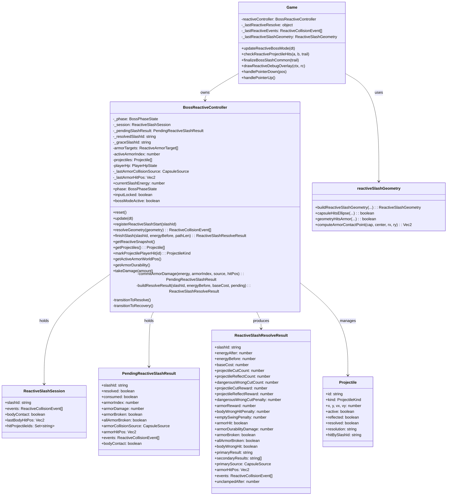
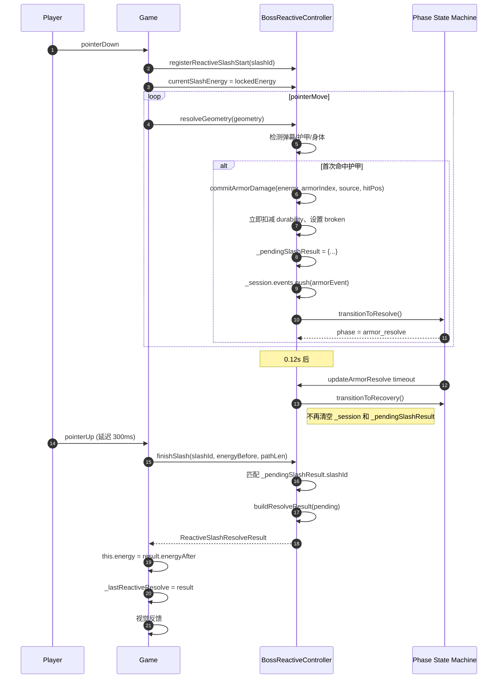
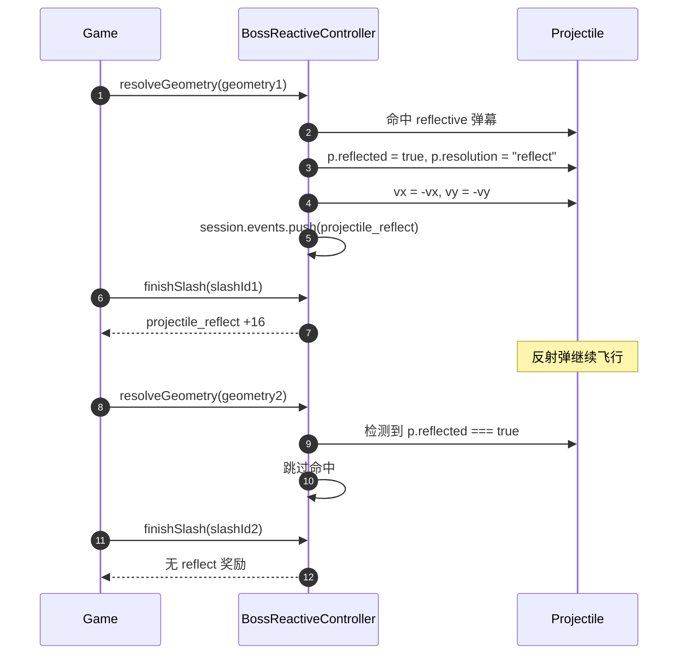
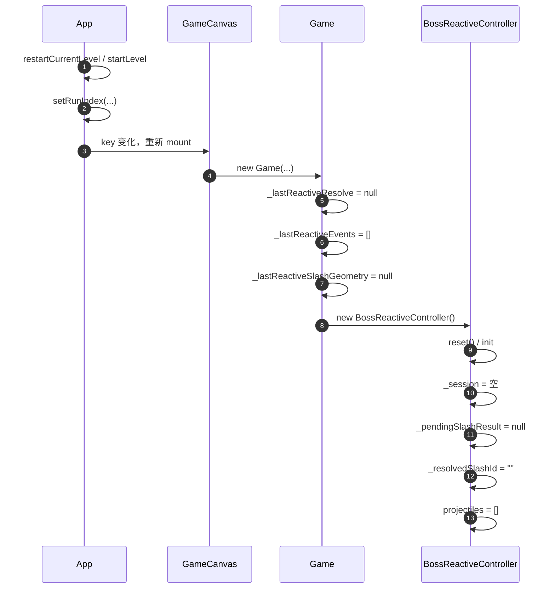
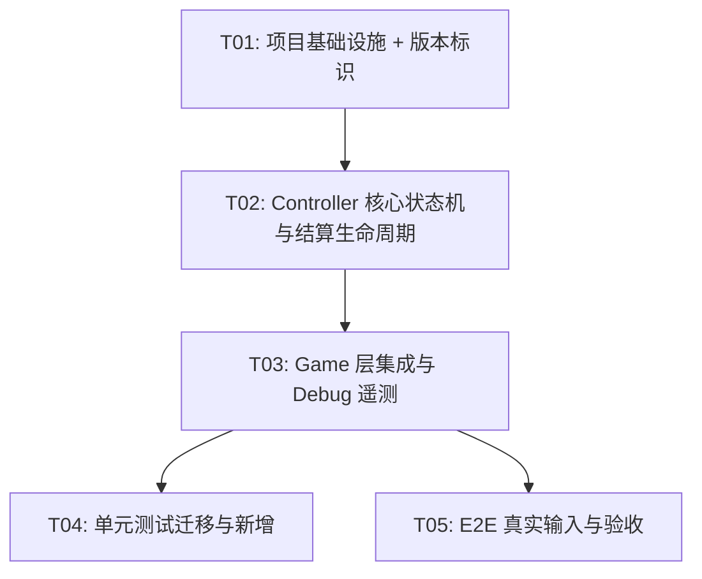

# V0723011 增量架构设计

> 版本：V0723010 → V0723011（P4.4B-R5.7 / 0723.011）  
> 目标：修复 P0 护甲结算时序、session 生命周期、反射弹终态、Debug 遥测、primaryResult 优先级、重试清理；补齐 E2E 真实输入用例；迁移并扩充 Reactive 单元测试。  
> 范围：Reactive Boss 模式核心循环、结算状态机、Debug 面板、单元测试、E2E 真实 Pointer 测试。

---

## 1. 增量实现方案

### 1.1 核心时序问题诊断

当前链路（P0-1 / P0-2 根因）：

```
resolveGeometry 命中护甲
  → _resolvedSlashId = slashId
  → transitionToResolve()
  → 0.12s 后 transitionToRecovery()
      → _resolvedSlashId = ""           // 关键：命中凭证丢失
      → _session = 空                    // 关键：事件被提前销毁
  → 玩家稍后 pointerUp
  → finishSlash(slashId)
      → _resolvedSlashId !== slashId
      → 按空挥结算 → empty_swing
```

### 1.2 P0-1/P0-2 统一修复思路：命中即提交 + pending 二级生命周期

1. **第一次护甲碰撞时立即提交**：在 `resolveGeometry` 检测到护甲命中的瞬间，固定并写入：
   - `armorIndex`（当前 activeArmorIndex 的快照）
   - `damage`（按 `lockedEnergy` 与当前护甲耐久计算）
   - `broken`、`allArmorBroken`
   - `source`（命中胶囊 `CapsuleSource`）
   - `hitPos`（胶囊与护甲椭圆的真实接触点，替代护甲中心）
   - 立即扣减 `armorTargets[armorIndex].durability`、更新 `crackProgress`、设置 `animTimer`。
2. **`finishSlash` 不再重新结算**：命中后所有护甲相关字段从 `pendingSlashResult` 读取，不再调用 `getCurrentArmor()` 和 `calculateArmorDamage()`。
3. **`pendingSlashResult` 二级生命周期**：
   - 创建：护甲首次碰撞 → `transitionToResolve()` 之前。
   - 保留：`transitionToRecovery()` 只清状态机 phase/timer，**不**删除 `_session` 和 `pendingSlashResult`。
   - 消费：`finishSlash(slashId)` 匹配到 `pendingSlashResult.slashId` 后消费，随后清理 `_session` 和 `pendingSlashResult`。
   - 超时未消费：若玩家一直按住到下一 opportunity 仍未松手，则旧 `pendingSlashResult` 被新刀的 `resolveGeometry` 覆盖或显式清理（见 1.6）。

### 1.3 P0-3 反射弹终态

- 反射弹被命中后设置 `p.reflected = true`、`p.resolution = "reflect"`、反向速度，**不再设置 `p.resolved = true`**（保留其飞行）。
- `resolveGeometry` 中任何 `p.reflected === true` 的弹幕跳过命中检测。
- `markProjectilePlayerHit` 同样跳过 `reflected` 弹幕。
- 被反射弹后续再次穿过的挥刀不会触发 `projectile_reflect` 事件，无奖励、无再次反向。

### 1.4 P0-4 Debug 遥测补全

`Game._lastReactiveResolve` 扩展字段：

- `cutReward`、`reflectReward`
- `cutCount`、`reflectCount`、`dangerousCount`
- `unclampedAfter`（结算前未 clamp 的能量，用于验证）
- `eventsSummary`（事件种类统计，如 `cut:2 reflect:1`）
- 删除 `projReward`（含义模糊，由 `cutReward` 替代）。

### 1.5 P0-5 primaryResult 优先级

当前优先级：`armorBroken > armorHit > projectile_reflect > projectile_cut > dangerous_wrong_cut > body_wrong_hit > empty_swing`。

问题：正向 `projectile_reflect` 会掩盖同刀的 `dangerous_wrong_cut`，导致危险误砍未反馈。

修复：

- `dangerous_wrong_cut` 优先级高于 `projectile_reflect` / `projectile_cut`。
- 新增 `secondaryResults: string[]`，按事件顺序记录除 primaryResult 外的其他结果（如 `["projectile_reflect", "dangerous_wrong_cut"]`），供 Debug 和日志完整呈现。

调整后优先级：

```
armor_broken > armor_hit > dangerous_wrong_cut > body_wrong_hit > projectile_reflect > projectile_cut > empty_swing
```

> `body_wrong_hit` 高于弹幕，因为身体误砍是负向惩罚，必须被玩家感知。

### 1.6 P0-6 重试/新局清理

- `BossReactiveController.reset()` 清理：`_session`、`_pendingSlashResult`、`_resolvedSlashId`、`_graceSlashId`、`_lastArmorCollisionSource`、`_lastBodyCollisionSource`、`_lastArmorHitPos`、projectiles、particles。
- `Game` 构造函数（新实例自然重置）额外显式清空：`_lastReactiveResolve`、`_lastReactiveEvents`、`_lastReactiveSlashGeometry`。
- `App.tsx` 版本号更新为 `V0723011`。

---

## 2. 修改/新增文件列表

| 相对路径 | 类型 | 说明 |
|---|---|---|
| `src/game/systems/BossReactiveController.ts` | 修改 | 核心：命中即提交、`pendingSlashResult`、反射弹终态、结果优先级、reset 清理。 |
| `src/game/Game.ts` | 修改 | Debug 遥测字段扩展、收刀结果消费、`unclampedAfter`、secondaryResults、constructor 显式清空遥测。 |
| `src/App.tsx` | 修改 | `appVersion` 更新为 `V0723011`。 |
| `src/game/systems/BossReactiveController.test.ts` | 修改 + 新增用例 | 全部迁移到 `resolveGeometry`；新增 hold-after-hit、session 保留、真实 reflect+16、二次反射阻止、retry 清理、输入策略、混合事件等测试；测试数 > 85。 |
| `e2e/boss-reactive-real-input.spec.ts` | 修改 + 新增用例 | 松手后改为 poll 真实状态；新增“命中后等待 300ms 再松手”用例。 |
| `e2e/boss-reactive-full-pointer.spec.ts` | 修改 | 第三甲断言改为使用 `lastReactiveExitSnapshot` 桥字段，不依赖瞬时 `3/3 + activeArmorIndex=2`。 |
| `src/game/systems/projectileSystem.ts` | 修改（P1） | `getProjectiles` 返回深拷贝快照；`markProjectilePlayerHit` 跳过 `reflected`。 |
| `src/game/systems/reactiveSlashGeometry.ts` | 修改（P1） | `projectile` 事件 `hitPos` 使用 `p.x/p.y`；护甲命中返回真实接触点辅助函数。 |

> 本次不新增独立文件，所有变更集中在现有模块内，降低集成风险。

---

## 3. 数据结构与接口变更

### 3.1 新增/修改接口（TypeScript）

```ts
// src/game/systems/BossReactiveController.ts

/** 命中后立即提交的护甲结算快照（二级生命周期） */
interface PendingReactiveSlashResult {
  slashId: string;
  resolved: boolean;           // 是否已发生护甲命中
  consumed: boolean;           // 是否已被 finishSlash 消费
  armorIndex: number;
  armorDamage: number;
  armorBroken: boolean;
  allArmorBroken: boolean;
  armorCollisionSource: CapsuleSource | null;
  armorHitPos: Vec2 | null;
  events: ReactiveCollisionEvent[];
  bodyContact: boolean;
  lastBodyHitPos?: Vec2;
}

/** 扩展 session：保留原始事件直到 finishSlash 消费 */
interface ReactiveSlashSession {
  slashId: string;
  events: ReactiveCollisionEvent[];
  bodyContact: boolean;
  lastBodyHitPos?: Vec2;
  hitProjectileIds: Set<string>;
}

/** 结算结果扩展 */
export interface ReactiveSlashResolveResult {
  slashId: string;
  energyAfter: number;
  energyBefore: number;
  baseCost: number;
  projectileCutCount: number;
  projectileReflectCount: number;
  dangerousWrongCutCount: number;
  projectileCutReward: number;
  projectileReflectReward: number;
  dangerousWrongCutPenalty: number;
  armorReward: number;
  bodyWrongHitPenalty: number;
  emptySwingPenalty: number;
  armorHit: boolean;
  armorDurabilityDamage: number;
  armorBroken: boolean;
  allArmorBroken: boolean;
  bodyWrongHit: boolean;
  primaryResult: string;
  secondaryResults: string[];          // 新增
  primarySource: CapsuleSource | "-";
  armorHitPos: Vec2 | null;
  events: ReactiveCollisionEvent[];
  unclampedAfter: number;              // 新增：clamp 前能量
}
```

### 3.2 BossReactiveController 私有字段变更

```ts
private _session: ReactiveSlashSession = { ... };
private _pendingSlashResult: PendingReactiveSlashResult | null = null;   // 新增
private _resolvedSlashId = "";
```

### 3.3 Game 遥测结构变更

```ts
private _lastReactiveResolve: {
  slashId: string;
  primaryResult: string;
  secondaryResults: string[];          // 新增
  primarySource: string;
  energyBefore: number;
  baseCost: number;
  cutReward: number;                   // 新增（替代 projReward）
  reflectReward: number;               // 新增
  armorReward: number;
  dangerousWrongCutPenalty: number;
  bodyWrongHitPenalty: number;
  emptySwingPenalty: number;
  energyAfter: number;
  unclampedAfter: number;              // 新增
  cutCount: number;                    // 新增
  reflectCount: number;                // 新增
  dangerousCount: number;              // 新增
  eventsSummary: string;               // 新增
} | null = null;
```

### 3.4 E2E 桥新增字段（Game.ts `getState`）

```ts
{
  ...existing,
  lastReactiveExitSnapshot?: {
    armorProgress: string;
    armorBroken: boolean[];
    armorDurability: number[];
    bridgeTriggered: boolean;
    gameMode: "bossReactive" | "boss";
  }
}
```

用于第三甲断言：在 reactiveController 被置空前捕获最终快照。

---

## 4. 程序调用流程

### 4.1 类图



### 4.2 时序图：命中后延迟松手（P0-1/P0-2 修复）



### 4.3 时序图：反射弹终态（P0-3）



### 4.4 时序图：重试/新局清理（P0-6）



---

## 5. 有序任务列表

### T01：项目基础设施 + 版本标识

- **源文件**：`src/App.tsx`
- **变更**：`appVersion` 从 `"V0723010"` 改为 `"V0723011"`；在 `startLevel`/`restartBattle` 中确认 `setRunIndex` 触发 GameCanvas 重新 mount（已存在，无需改动，仅复核）。
- **依赖**：无
- **优先级**：P0

### T02：Controller 核心状态机与结算生命周期

- **源文件**：`src/game/systems/BossReactiveController.ts`、`src/game/systems/projectileSystem.ts`、`src/game/systems/reactiveSlashGeometry.ts`
- **变更**：
  - 新增 `PendingReactiveSlashResult` 与扩展 `ReactiveSlashResolveResult`。
  - `resolveGeometry` 命中护甲时立即调用 `commitArmorDamage()`，写入 pending 并提交耐久变化。
  - `transitionToRecovery()` 不再删除 `_session` / `_pendingSlashResult`。
  - `finishSlash()` 优先消费 `_pendingSlashResult`，不再通过 `getCurrentArmor()` 二次结算。
  - 反射弹进入 `reflected` 终态，禁止再次命中。
  - `getProjectiles()` 返回深拷贝快照；`markProjectilePlayerHit` 跳过 reflected。
  - 恢复/补齐统一世界变换接口的使用（`localToBossWorld`、`getArmorWorldGeometry`、`getProjectileSpawnOrigin`）。
  - `projectile` 事件 `hitPos` 改为 `p.x/p.y`；护甲命中 `hitPos` 改为真实接触点。
- **依赖**：T01
- **优先级**：P0

### T03：Game 层集成与 Debug 遥测

- **源文件**：`src/game/Game.ts`
- **变更**：
  - 扩展 `_lastReactiveResolve` 类型，新增 `cutReward`、`reflectReward`、`cutCount`、`reflectCount`、`dangerousCount`、`unclampedAfter`、`secondaryResults`、`eventsSummary`。
  - `finalizeBossSlashCommon` 读取 `result` 并写入扩展遥测；移除 `projReward`。
  - `drawReactiveDebugOverlay` 替换 `projReward` 为 `cutReward/reflectReward/counts/summary/unclampedAfter`。
  - 构造函数显式清空 `_lastReactiveResolve`、`_lastReactiveEvents`、`_lastReactiveSlashGeometry`。
  - 在桥接检测前置空 `reactiveController` 前，捕获 `lastReactiveExitSnapshot` 供 E2E 使用。
- **依赖**：T02
- **优先级**：P0

### T04：单元测试迁移与新增

- **源文件**：`src/game/systems/BossReactiveController.test.ts`
- **变更**：
  - 删除或私有化 `resolveSegment`（测试全部改为 `resolveGeometry`）。
  - 保留并修复现有 85+ 用例的调用方式。
  - 新增用例：
    - `hold-after-hit`：命中后等待 recovery 再 `finishSlash`，断言仍为 `armor_hit`。
    - `session 保留`：`transitionToRecovery` 后 `finishSlash` 仍能消费原事件。
    - `真实 reflect+16`：高刀势反射 reflective 弹幕奖励 16。
    - `二次反射阻止`：同一 reflective 弹幕被两刀挥过仅第一次触发。
    - `retry 清理`：`reset()` 后 pending/session/resolvedSlashId 为空。
    - `输入策略`：`inputLocked` 在 prepare/resolve/recovery 为 true。
    - `混合事件`：同刀同时触发 `projectile_cut` + `dangerous_wrong_cut`，断言 `primaryResult` 为 `dangerous_wrong_cut`，`secondaryResults` 包含 `projectile_cut`。
  - 测试总数必须 > 85。
- **依赖**：T02
- **优先级**：P0

### T05：E2E 真实输入与验收

- **源文件**：`e2e/boss-reactive-real-input.spec.ts`、`e2e/boss-reactive-full-pointer.spec.ts`
- **变更**：
  - `boss-reactive-real-input.spec.ts`：
    - 将松手后立即 `getState()` 改为 `expect.poll` 真实状态。
    - 新增 test：`真实 Pointer 命中后等待 300ms 再松手仍结算为 armor_hit`。
  - `boss-reactive-full-pointer.spec.ts`：
    - 第三甲断言改为读取 `lastReactiveExitSnapshot`，不依赖瞬时 `armorProgress=3/3` + `activeArmorIndex=2`。
- **依赖**：T03
- **优先级**：P0

---

## 6. 任务依赖图



---

## 7. 共享知识

### 7.1 跨文件约定

1. **能量唯一写入点**：Reactive 模式下，`this.energy` 的唯一写入点是 `finalizeBossSlashCommon` 中的 `this.energy = result.energyAfter`。`recoverEnergy` 只负责被动恢复。
2. **结算唯一来源**：`ReactiveSlashResolveResult` 由 `BossReactiveController.finishSlash` 完整计算，Game 只做消费和反馈，禁止二次推导。
3. **`pendingSlashResult` 消费规则**：
   - 创建：首次护甲碰撞瞬间。
   - 消费：`finishSlash(slashId)` 且 `pending.slashId === slashId`。
   - 清理：消费后或 `reset()` 后。
4. **`reflected` 终态**：任何弹幕一旦 `reflected === true`，后续所有挥刀和玩家防线命中均忽略它。
5. **`unclampedAfter` 含义**：`energyBefore - baseCost + rewards - penalties`，用于 Debug 验证数值是否有溢出/下溢。
6. **事件 `hitPos` 语义**：
   - 弹幕事件使用弹幕中心 `p.x/p.y`。
   - 护甲/身体事件使用真实几何接触点。
7. **E2E 桥字段**：新增 `lastReactiveExitSnapshot`，在 `reactiveController` 被置空前填充，供第三甲稳定断言。

### 7.2 版本号更新规则

- `src/App.tsx` 中的 `appVersion` 必须与新版本号一致：`V0723011`。
- 构建产物或 `package.json` 如有版本字段同步更新（如存在）。

### 7.3 E2E 桥约定

- `getState()` 在 Reactive 模式下返回 `phase`、`armorProgress`、`armorDurability`、`activeArmorIndex`、`gameMode`、`lastReactiveExitSnapshot` 等。
- E2E 断言尽量使用 `expect.poll` 轮询真实状态，而非固定 `waitForTimeout`。
- 真实 Pointer 测试禁止调用 `window.__ONE_BLADE_E2E__.slashArmor()`。

### 7.4 测试约定

- 单元测试禁止直接读写 `BossReactiveController` 私有字段。
- 所有 Reactive 命中测试必须通过 `resolveGeometry` 构建真实刀体几何。
- `resolveSegment` 可标记为 `private` 或删除；测试不再调用。

---

## 8. 风险点和待明确事项

### 8.1 风险点

| 风险 | 影响 | 缓解措施 |
|---|---|---|
| `pendingSlashResult` 与下一刀的并发 | 若玩家按住跨多个 opportunity 不松手，新刀的 `resolveGeometry` 可能覆盖旧 pending | `finishSlash` 严格按 `slashId` 消费；新刀创建新 session，旧 pending 在 `finishSlash` 不匹配时自然失效。 |
| 反射弹 `reflected=true` 但 `active=true` 持续飞行，可能飞回 Boss 上方造成视觉干扰 | 低 | 反射弹速度反向，maxLife 正常衰减；如超出屏幕由 `updateProjectiles` 处理。 |
| 优先级调整后 `body_wrong_hit` 高于 `projectile_reflect`，可能让玩家觉得“明明反了弹为什么显示偏斩” | 中 | 通过 `secondaryResults` 在 Debug 中展示完整事件，正式反馈仍按优先级显示最严重后果。 |
| Debug 面板字段增加导致行数过多 | 低 | 面板高度动态计算 `lines.length * 14 + 8`，无需硬编码。 |
| E2E 真实 Pointer 在 CI 低性能环境 flaky | 中 | 使用 `expect.poll` 和 90s timeout；新增 300ms hold 用例单独跑。 |
| 测试数 > 85 的目标 | 低 | 通过新增 8~10 个用例覆盖，现有 82 个测试迁移后自然超过。 |

### 8.2 待明确事项

1. **P0-2 “超时未消费”清理策略**：是否需要在 `transitionToOpportunity()`（新窗口开始）时主动丢弃上一窗口未消费的 `pendingSlashResult`？建议保留到 `finishSlash` 不匹配时由消费逻辑清理，避免极端 case 下旧结果泄漏。
2. **`secondaryResults` 排序**：是否按事件时间顺序？建议按事件出现顺序，与 `events` 数组一致。
3. **第三甲 `lastReactiveExitSnapshot` 字段**：是否需要在 `getTargets()` 也暴露，还是仅 `getState()`？建议仅在 `getState()` 暴露，保持 `getTargets()` 语义不变。
4. **`getProjectiles()` 深拷贝**：返回完整 `Projectile[]` 深拷贝可能影响每帧性能（projectiles 数量 < 10）。建议浅拷贝对象数组（`[...projectiles].map(p => ({...p}))`），足够满足“外部只读不篡改”需求。

---

## 9. 验收标准

- [ ] V0723011 版本号已更新。
- [ ] 命中护甲后延迟 300ms 松手，结算仍为 `armor_hit`，不会变 `empty_swing`。
- [ ] 按住跨 resolve/recovery，session 事件和护甲结果保留到 `finishSlash`。
- [ ] 反射弹被第一刀反射后，第二刀命中不再触发奖励和再次反向。
- [ ] Debug 面板显示 `cutReward/reflectReward/counts/unclampedAfter/eventsSummary`，无 `projReward`。
- [ ] 同刀 `projectile_reflect + dangerous_wrong_cut` 时 `primaryResult` 为 `dangerous_wrong_cut`，`secondaryResults` 包含 `projectile_reflect`。
- [ ] 失败重试/新一局后，Game Debug 遥测和 Controller pending/session 全部清空。
- [ ] `BossReactiveController.test.ts` 测试数 > 85，且全部使用 `resolveGeometry`。
- [ ] E2E 真实 Pointer 三甲流程通过，第三甲使用 `lastReactiveExitSnapshot` 断言。
