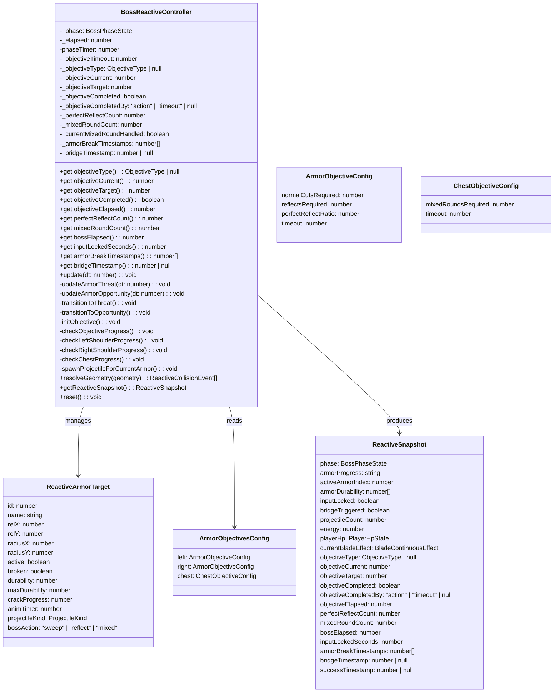
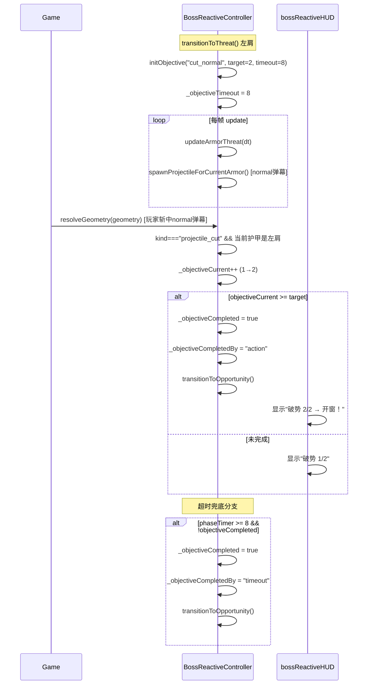
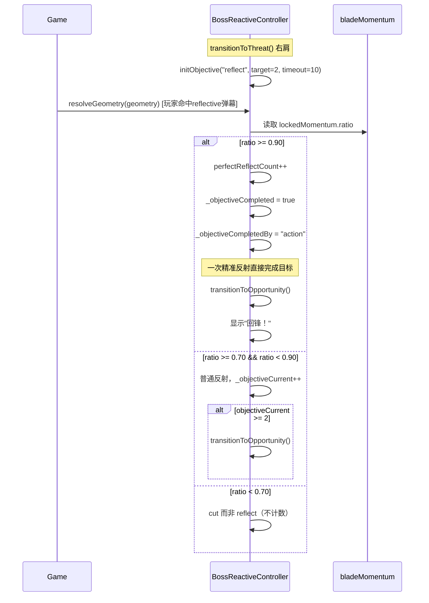
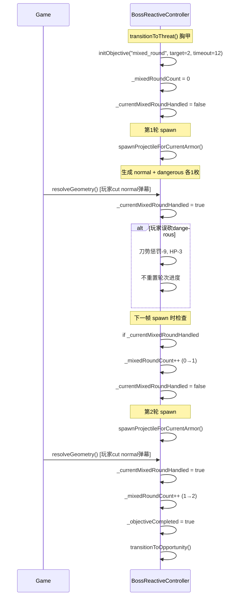
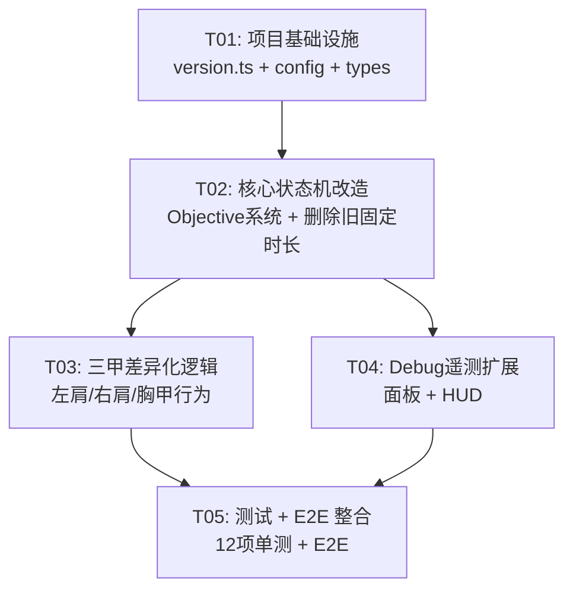

# 《我只要一刀》V0723016 — 三甲节奏系统架构设计

> 架构师：高见远（Gao）
> 基线：V0723015（稳定）
> 目标：Boss 体验从 ~36 秒提升至熟练玩家 55-65 秒 / 普通玩家 65-75 秒

---

## 1. 实现方案 + 关键决策

### 1.1 核心改造：threat→opportunity 从"固定时长"改为"目标驱动"

**现状问题**：`updateArmorThreat()` 中 `phaseTimer >= threatDuration`（2.0~3.0s 随机）直接触发 `transitionToOpportunity()`。玩家无法通过操作加速进程，纯等固定时长。

**改造方案**：引入 **Objective 目标系统**，在 threat 阶段追踪玩家操作进度。

```
threat 阶段退出条件改为：
  if (objectiveCompleted || phaseTimer >= timeout) → transitionToOpportunity()
```

**状态机变更**：

| 旧行为 | 新行为 |
|--------|--------|
| `threatDuration` 随机 2.0~3.0s 决定开窗 | 删除 `threatDuration` 随机变量 |
| `transitionToOpportunity()` 只由计时器触发 | 由两个来源触发：objective 完成 / 超时兜底 |
| 开窗来源只有固定计时器 1 个 | 开窗来源 2 个：目标完成 / 超时兜底 |
| 无 objective 追踪 | 新增 `objectiveType/current/target/elapsed` 只读状态 |

### 1.2 三甲目标差异化设计

#### 左肩·斩弹破势（ARMOR_L）

| 属性 | 值 |
|------|-----|
| 目标类型 | `cut_normal` |
| 完成条件 | 玩家累计斩断 2 枚普通弹幕 |
| 超时兜底 | 8 秒 |
| 进度显示 | "破势 1/2" |
| burst 破甲 | 仍然有效（不改变旧机制） |
| 弹幕奖励 | 8（不变） |
| 护甲伤害 | 25/55/直接破甲（不变） |
| 目标耗时 | 8-12 秒 |

**实现**：在 `resolveGeometry` 中，当 `kind === "projectile_cut"` 且当前护甲为左肩时，递增 `objectiveCurrent`。达到 `objectiveTarget`（2）时设置 `objectiveCompleted = true`，下帧 `updateArmorThreat` 检测到后立即开窗。

**边界**：burst 一刀破甲仍算破甲，不经过 objective 系统。但破甲本身会触发 `transitionToResolve`，所以不会进入开窗流程。

#### 右肩·回锋反制（ARMOR_R）

| 属性 | 值 |
|------|-----|
| 目标类型 | `reflect` |
| 完成条件 | 普通反射累计 2 次 **或** 精准反射 1 次 |
| 精准反射阈值 | `ratio >= 0.90`（`precision_reflect` 节点） |
| 超时兜底 | 10 秒 |
| 70% 能力保留 | 仍可普通反射（刀势 >= 70%） |
| 89.99% 不触发 | 浮点比较 `ratio >= 0.90`，非 `> 0.90` |
| 反射奖励 | 16（不变） |
| 目标耗时 | 20-28 秒 |

**精准反射判定**：
```
if (momentum.ratio >= 0.90) {
  // 精准反射 — 一次即完成目标
  // 显示"回锋！"
  if (当前护甲为右肩) {
    objectiveCompleted = true;  // 立即开窗
  }
} else if (momentum.band === "burst" && momentum.ratio < 0.90) {
  // 普通反射（70% ≤ ratio < 90%）
  // 累计到 reflectCount，达到 2 次开窗
}
```

**浮点精度**：`ratio` 由 `resolveBladeMomentumRatio` 计算，`clamp(current/max, 0, 1)`。直接比较 `ratio >= 0.90`，不做 `Math.abs(ratio - 0.90) < 1e-10` 容差，因为 `ratio` 是除法结果，精确到浮点。89.99% 时 `ratio = 0.8999`，`0.8999 >= 0.90` 为 false，正确。

#### 胸甲·真假雷阵（ARMOR_C）

| 属性 | 值 |
|------|-----|
| 目标类型 | `mixed_round` |
| 完成条件 | 完成 2 轮混合处理 |
| 每轮完成条件 | 至少处理 1 枚普通/强化弹幕（cut 或 reflect） |
| 危险弹幕 | 可避开，误砍则刀势惩罚 9 + HP 伤害 3 |
| 误砍后果 | 不重置进度，不额外延长等待 |
| 超时兜底 | 12 秒 |
| 目标耗时 | 34-45 秒 |

**轮次机制**：胸甲 threat 阶段每轮 spawn 同时生成 `normal + dangerous` 各一枚。新状态 `mixedRoundCount` 追踪已完成轮次（0/2）。每轮中，当玩家 cut 或 reflect 至少 1 枚非危险弹幕后，该轮标记为"已处理"。下一帧 spawn 时自动进入下一轮。

**危险误砍**：在 `resolveGeometry` 中，误砍 dangerous 弹幕时，执行惩罚逻辑（刀势 -9、HP -3），但不调用任何 `resetObjective` 或延长计时器。

**轮次切换时机**：不是在固定时间切轮，而是在当前轮次被处理（至少 1 枚非危险弹幕被处理）后，下一次 spawn 生成下一轮的弹幕。

### 1.3 旧 threatDuration 第三套来源删除

**修改**：
1. 删除 `transitionToThreat()` 中的 `this.threatDuration = min + Math.random() * (max - min)`
2. 删除 `updateArmorThreat()` 中的 `if (this.phaseTimer >= this.threatDuration)` 条件
3. 替换为：`if (this._objectiveCompleted || this.phaseTimer >= this._objectiveTimeout)`
4. `phaseTimers.threatDuration` 配置项改为 `armorObjectives.{left|right|chest}.timeout`
5. `threatDuration` 私有字段改为 `_objectiveTimeout`（按当前护甲从配置读取）

### 1.4 桥接保持唯一性

**规则**：`bridgeTriggered` 只能由 `finishRecovery` 在所有护甲破碎后触发一次。objective 系统不干预桥接逻辑。`reset()` 时清空所有 objective 状态。

### 1.5 机会窗口打开方式验证

窗口打开后，**只能通过**：
1. 目标完成（`objectiveCompleted = true` → `transitionToOpportunity()`）
2. 超时兜底（`phaseTimer >= _objectiveTimeout` → `transitionToOpportunity()`）

不得保留旧的 `threatDuration` 第三套来源。`transitionToOpportunity()` 始终保持不变（清 grace、设 phase、设 animTimer）。

---

## 2. 文件列表及相对路径

| # | 文件路径 | 修改类型 | 说明 |
|---|----------|----------|------|
| 1 | `src/version.ts` | 修改 | V0723015 → V0723016 |
| 2 | `src/game/config/bossReactiveFlow.ts` | 修改 | 新增 `armorObjectives` 配置块，删除 `phaseTimers.threatDuration` |
| 3 | `src/game/types.ts` | 修改 | 新增 `ObjectiveType`、`ObjectiveState` 等类型 |
| 4 | `src/game/config/bladeMomentum.ts` | 修改 | 确保 `precision_reflect` 阈值 0.90 清晰可引用 |
| 5 | `src/game/systems/BossReactiveController.ts` | 修改 | 核心改造：objective 系统、状态机变更、三甲差异化逻辑 |
| 6 | `src/game/systems/bossReactiveHUD.ts` | 修改 | 新增 objective 进度 HUD 渲染函数 |
| 7 | `src/game/Game.ts` | 修改 | Debug 遥测面板扩展、Controller 新状态接入 |
| 8 | `src/game/systems/BossReactiveController.test.ts` | 修改 | 新增 12 项三甲单测 |
| 9 | `e2e/boss-reactive-real-input.spec.ts` | 修改 | 新增三甲 E2E 场景 |
| 10 | `e2e/boss-reactive-full-pointer.spec.ts` | 修改 | 新增三甲完整流程 E2E |
| 11 | `docs/incremental-design-V0723016.md` | 新增 | 本设计文档 |
| 12 | `docs/class-diagram.mermaid` | 新增 | 类图 |
| 13 | `docs/sequence-diagram.mermaid` | 新增 | 时序图 |
| 14 | `README.md` | 修改 | 版本号更新 |

---

## 3. 数据结构和接口

### 3.1 新增类型定义（`src/game/types.ts`）

```typescript
/** 三甲目标类型 */
export type ObjectiveType = "cut_normal" | "reflect" | "mixed_round";

/** 三甲目标配置 */
export interface ArmorObjectiveConfig {
  normalCutsRequired: number;   // 左肩：斩弹需求数
  reflectsRequired: number;     // 右肩：普通反射需求数
  perfectReflectRatio: number;  // 右肩：精准反射阈值
  timeout: number;              // 超时兜底秒数
}

/** 三甲目标集合 */
export interface ArmorObjectivesConfig {
  left: ArmorObjectiveConfig;
  right: ArmorObjectiveConfig;
  chest: { mixedRoundsRequired: number; timeout: number };
}

/** armorObjectives 配置键 */
export type ArmorKey = "left" | "right" | "chest";
```

### 3.2 Controller 新增只读状态（`BossReactiveController`）

```typescript
/** 目标只读状态（通过 getter 暴露） */
get objectiveType(): ObjectiveType | null;
get objectiveCurrent(): number;
get objectiveTarget(): number;
get objectiveCompleted(): boolean;
get objectiveElapsed(): number;
get perfectReflectCount(): number;
get mixedRoundCount(): number;
get bossElapsed(): number;
```

### 3.3 getReactiveSnapshot 扩展字段

```typescript
// 在 getReactiveSnapshot() 返回值中新增：
objectiveType: ObjectiveType | null;
objectiveCurrent: number;
objectiveTarget: number;
objectiveCompleted: boolean;
objectiveCompletedBy: "action" | "timeout" | null;
objectiveElapsed: number;
perfectReflectCount: number;
mixedRoundCount: number;
bossElapsed: number;
inputLockedSeconds: number;   // 累计输入锁定秒数
armorBreakTimestamps: number[];  // 三甲破甲时间戳
bridgeTimestamp: number | null;  // 桥接触发时间戳
successTimestamp: number | null; // 胜利时间戳（由 Game 设置）
```

### 3.4 配置变更（`bossReactiveFlow.ts`）

```typescript
// 新增
armorObjectives: {
  left: { normalCutsRequired: 2, timeout: 8 },
  right: { reflectsRequired: 2, perfectReflectRatio: 0.9, timeout: 10 },
  chest: { mixedRoundsRequired: 2, timeout: 12 },
},

// 删除 phaseTimers.threatDuration（改为从 armorObjectives 读 timeout）
// 保留 phaseTimers 中的其他字段不变
```

### 3.5 类图



---

## 4. 程序调用流程

### 4.1 左肩目标驱动开窗时序



### 4.2 右肩精准反射时序



### 4.3 胸甲混合轮次时序



---

## 5. 任务列表

### 5.1 依赖包列表

无需新增第三方包。全为现有 Vite + React 19 + TypeScript + Canvas + Vitest + Playwright 栈内修改。

### 5.2 任务列表（按依赖顺序）

#### T01: 项目基础设施 — 配置 + 类型 + 版本

| 属性 | 值 |
|------|-----|
| **Task ID** | T01 |
| **名称** | 项目基础设施：配置中心 + 类型定义 + 版本号 |
| **依赖** | 无 |
| **优先级** | P0 |
| **源文件** | `src/version.ts`, `src/game/config/bossReactiveFlow.ts`, `src/game/types.ts`, `src/game/config/bladeMomentum.ts` |

**具体内容**：

1. **`src/version.ts`**：`APP_VERSION = "V0723016"`，`BUILD_VERSION = "0723.016"`
2. **`src/game/config/bossReactiveFlow.ts`**：
   - 新增 `armorObjectives` 配置块（`left: {normalCutsRequired:2, timeout:8}`, `right: {reflectsRequired:2, perfectReflectRatio:0.9, timeout:10}`, `chest: {mixedRoundsRequired:2, timeout:12}`）
   - 删除 `phaseTimers.threatDuration`（数组 `[2.0, 3.0]`）
   - 保留 `phaseTimers` 其他字段不变
3. **`src/game/types.ts`**：
   - 新增 `ObjectiveType = "cut_normal" | "reflect" | "mixed_round"`
   - 新增 `ArmorObjectiveConfig` 接口
   - 新增 `ArmorObjectivesConfig` 接口
   - 新增 `ArmorKey = "left" | "right" | "chest"`
4. **`src/game/config/bladeMomentum.ts`**：确保 `precision_reflect` 阈值 = `0.90` 清晰可引用（已有，无需修改，但需确认常量名不被误改）

---

#### T02: 核心状态机改造 — Objective 系统 + 目标驱动开窗

| 属性 | 值 |
|------|-----|
| **Task ID** | T02 |
| **名称** | 核心状态机改造：Objective 目标驱动系统 + 删除旧固定时长开窗 |
| **依赖** | T01 |
| **优先级** | P0 |
| **源文件** | `src/game/systems/BossReactiveController.ts`, `docs/incremental-design-V0723016.md`, `docs/class-diagram.mermaid`, `docs/sequence-diagram.mermaid` |

**具体内容**：

1. **`BossReactiveController.ts`** 新增私有字段：
   - `_objectiveType: ObjectiveType | null`
   - `_objectiveCurrent: number`
   - `_objectiveTarget: number`
   - `_objectiveCompleted: boolean`
   - `_objectiveCompletedBy: "action" | "timeout" | null`
   - `_objectiveTimeout: number`（替代旧的 `threatDuration`）
   - `_perfectReflectCount: number`
   - `_mixedRoundCount: number`
   - `_currentMixedRoundHandled: boolean`
   - `_armorBreakTimestamps: number[]`
   - `_bridgeTimestamp: number | null`
   - `_inputLockedSeconds: number`

2. **`BossReactiveController.ts`** 新增方法：
   - `private initObjective(): void` — 根据当前护甲设置 objective 参数
   - `private checkObjectiveProgress(): void` — 检查 objective 完成条件
   - `private checkLeftShoulderProgress(): void` — 左肩斩弹计数
   - `private checkRightShoulderProgress(): void` — 右肩反射计数/精准反射
   - `private checkChestProgress(): void` — 胸甲轮次管理

3. **`BossReactiveController.ts`** 状态机修改：
   - `transitionToThreat()`：删除 `threatDuration` 随机设置，改为 `initObjective()`
   - `updateArmorThreat()`：删除 `phaseTimer >= threatDuration`，改为 `if (this._objectiveCompleted || this.phaseTimer >= this._objectiveTimeout)`
   - `finishRecovery()`：记录破甲时间戳 `_armorBreakTimestamps.push(this._elapsed)`
   - `reset()`：清空所有 objective 状态

4. **`BossReactiveController.ts`** 新增 getter：
   - `objectiveType`, `objectiveCurrent`, `objectiveTarget`, `objectiveCompleted`, `objectiveElapsed`, `perfectReflectCount`, `mixedRoundCount`, `bossElapsed`, `inputLockedSeconds`, `armorBreakTimestamps`, `bridgeTimestamp`

---

#### T03: 三甲差异化逻辑 — 左肩斩弹/右肩反射/胸甲轮次

| 属性 | 值 |
|------|-----|
| **Task ID** | T03 |
| **名称** | 三甲差异化行为逻辑：左肩斩弹计数、右肩精准反射、胸甲混合轮次 |
| **依赖** | T02 |
| **优先级** | P0 |
| **源文件** | `src/game/systems/BossReactiveController.ts`, `src/game/systems/bossReactiveHUD.ts`, `src/game/Game.ts` |

**具体内容**：

1. **`BossReactiveController.ts`** — `resolveGeometry()` 中增加 objective 逻辑：
   - 左肩（`ARMOR_L`）：`projectile_cut` 事件时 `_objectiveCurrent++`
   - 右肩（`ARMOR_R`）：`projectile_reflect` 事件时检查 `lockedMomentum.ratio >= 0.90` → 精准反射（`_perfectReflectCount++`，直接完成）或普通反射（`_objectiveCurrent++`）
   - 胸甲（`ARMOR_C`）：`spawnProjectileForCurrentArmor()` 中管理轮次切换，`resolveGeometry` 中追踪 `_currentMixedRoundHandled`

2. **`BossReactiveController.ts`** — `spawnProjectileForCurrentArmor()` 胸甲分支修改：
   - 每轮 spawn 前检查 `_currentMixedRoundHandled` → 递增 `_mixedRoundCount`，重置 `_currentMixedRoundHandled`
   - 每轮 spawn 生成 `normal + dangerous` 各 1 枚（已有逻辑不变）
   - 危险误砍惩罚：刀势 -9，HP -3，不重置轮次

3. **`bossReactiveHUD.ts`** — 新增 Object 进度显示函数：
   - `drawArmorObjectiveProgress(ctx, objectiveType, current, target, x, y)` — 绘制目标进度条/文字

4. **`Game.ts`** — 在 `renderReactiveBossMode` 中调用 objective 进度 HUD

---

#### T04: Debug 遥测扩展

| 属性 | 值 |
|------|-----|
| **Task ID** | T04 |
| **名称** | Debug 遥测面板扩展：新增三甲目标/时序字段 |
| **依赖** | T02 |
| **优先级** | P1 |
| **源文件** | `src/game/systems/BossReactiveController.ts`, `src/game/Game.ts`, `src/game/systems/bossReactiveHUD.ts` |

**具体内容**：

1. **`BossReactiveController.ts`** — `getReactiveSnapshot()` 返回值扩展：
   - 新增 `objectiveType/current/target/completed/completedBy/elapsed`
   - 新增 `perfectReflectCount/mixedRoundCount/bossElapsed`
   - 新增 `inputLockedSeconds/armorBreakTimestamps/bridgeTimestamp`

2. **`Game.ts`** — `drawReactiveDebugOverlay()` 扩展：
   - 新增 Debug 行：`BossElapsed`、`ArmorElapsed`、`Objective current/target`、`Objective completedBy: action|timeout`、`PerfectReflectCount`、`InputLockedSeconds`、`ArmorBreakTimestamps`、`BridgeTimestamp`

3. **`bossReactiveHUD.ts`** — 新增 Debug 遥测绘制辅助函数（可选）

---

#### T05: 测试 + E2E 整合

| 属性 | 值 |
|------|-----|
| **Task ID** | T05 |
| **名称** | 三甲单测 12 项 + E2E 扩展 + 最终验证 |
| **依赖** | T03, T04 |
| **优先级** | P0 |
| **源文件** | `src/game/systems/BossReactiveController.test.ts`, `e2e/boss-reactive-real-input.spec.ts`, `e2e/boss-reactive-full-pointer.spec.ts`, `README.md` |

**具体内容**：

1. **`BossReactiveController.test.ts`** — 新增 12 项单测：

| 编号 | 测试名 | 断言 |
|------|--------|------|
| K1 | 左肩斩2枚弹幕开窗 | 目标完成 → opportunity |
| K2 | 左肩8秒超时开窗 | 未斩弹幕，timeout → opportunity |
| K3 | 右肩2次普通反射开窗 | 2次普通反射 → opportunity |
| K4 | 右肩90%精准反射一次开窗 | 1次精准反射 → opportunity |
| K5 | 89.99%不触发精准反射 | ratio=0.8999，不触发，仍为普通反射 |
| K6 | 胸甲2轮混合处理开窗 | 2轮各处理1枚normal → opportunity |
| K7 | 胸甲危险误砍不重置进度 | 误砍dangerous后仍可继续当前轮次 |
| K8 | 三甲timeout不软锁 | 三甲各自超时后正常开窗，不卡死 |
| K9 | 目标完成只开窗一次 | 完成后再完成不触发二次开窗 |
| K10 | 完整三甲只桥接一次 | 三甲全破后 bridgeTriggered=true |
| K11 | reset清空objective状态 | reset后所有objective归零 |
| K12 | 原数值不变（护甲耐久/伤害/奖励） | 验证旧配置未被修改 |

2. **`e2e/boss-reactive-real-input.spec.ts`** — 新增 E2E 场景：
   - 左肩斩弹进度验证（真实鼠标拖拽斩弹）
   - 右肩反射计数验证
   - 胸甲混合轮次验证

3. **`e2e/boss-reactive-full-pointer.spec.ts`** — 扩展完整三甲 E2E：
   - 三甲目标进度遥测验证
   - 桥接时间戳验证

4. **`README.md`** — 版本号更新为 V0723016

---

## 6. 任务依赖图



---

## 7. 共享知识

### 7.1 浮点比较规范

- `ratio` 比较使用 `>=` 直接比较，不做浮点容差
- 89.99% → `ratio = 0.8999` → `0.8999 >= 0.90` = `false` ✓
- 90.00% → `ratio = 0.90` → `0.90 >= 0.90` = `true` ✓
- 禁止使用 `Math.abs(ratio - 0.90) < 1e-10` 这种容差写法

### 7.2 objectiveCompleted 枚举

```
objectiveCompletedBy: "action" | "timeout" | null
- "action": 玩家通过操作完成目标
- "timeout": 超时兜底触发
- null: 尚未完成
```

### 7.3 时间戳记录口径

- 所有时间戳使用 `this._elapsed`（全局累计秒数，从 Controller 构造开始计时）
- `armorBreakTimestamps`：每次护甲破碎时 push `this._elapsed`
- `bridgeTimestamp`：`bridgeTriggered` 设为 true 时记录 `this._elapsed`
- `bossElapsed` getter 直接返回 `this._elapsed`

### 7.4 配置魔法数禁止

- 所有数值参数必须从 `armorObjectives` 配置读取
- 禁止在 Controller 中硬编码 `2`、`8`、`10`、`12` 等魔法数
- 禁止在测试中硬编码预期值（使用配置常量比较）

### 7.5 修改边界白名单

```
允许修改的文件列表（白名单）：
src/game/Game.ts
src/game/types.ts
src/game/config/bossReactiveFlow.ts
src/game/config/bladeMomentum.ts
src/game/systems/BossReactiveController.ts
src/game/systems/BossReactiveController.test.ts
src/game/systems/bossReactiveHUD.ts
e2e/boss-reactive-real-input.spec.ts
e2e/boss-reactive-full-pointer.spec.ts
src/version.ts
README.md
index.html
package.json
package-lock.json
docs/incremental-design-V0723016.md
```

### 7.6 禁止修改项

- 护甲耐久 100（`durabilityPerPiece`）
- 护甲伤害 25/55/直接破甲（`lowEnergyCrack`/`midEnergyDamage`/`highEnergyOneShot`）
- 刀势消耗与 V0723015 奖励
- 空挥/危险/身体惩罚数值
- 玩家 HP 与伤害
- 旧追击伤害
- 终结判定
- 天雷判定
- 普通关卡
- 副刀
- 广告与成长 UI

---

## 8. 待明确事项

### 8.1 胸甲轮次 spawn 时机

**问题**：胸甲每轮 spawn 生成 normal + dangerous 各 1 枚。当前轮次被处理（至少 1 枚非危险弹幕被处理）后，下一枚 spawn 进入下一轮。但 spawn 间隔受 `threatSpawn.intervalBase + intervalJitter` 控制。

**决策**：保持 spawn 间隔不变（0.85 + random 0.2）。轮次切换在 spawn 时检查 `_currentMixedRoundHandled`。如果当前轮次尚未被处理，继续 spawn 同一轮的弹幕（补充式生成）。如果已被处理，进入下一轮。

**待确认**：是否需要在轮次被处理后立即 spawn 下一轮（缩短间隔），还是等下一个 spawn tick？建议保持现有 spawn 节奏，不额外缩短。

### 8.2 左肩 burst 一刀破甲

**问题**：左肩如果 burst 一刀直接破甲（不经过 objective 系统），是否算作"开窗"？目前 burst 在 opportunity 阶段才生效，threat 阶段命中护甲只返回 `armor_closed`。

**答案**：burst 一刀破甲在 threat 阶段不生效（`armor_closed`），在 opportunity 阶段才生效。所以不影响 objective 系统。但需确认：如果玩家在 left 的 threat 阶段 burst 一刀命中护甲，应该只返回 `armor_closed`，不触发 objective 完成。

### 8.3 精准反射的视觉反馈

**待确认**：精准反射触发时，需要什么视觉/文字反馈？建议：
- 屏幕中央显示"回锋！"文字（金色，类似"破甲！"）
- 粒子特效比普通反射更华丽（金色大爆裂）
- 音效待定

### 8.4 胸甲 mixed 轮次"处理"的定义

**待确认**：胸甲轮次中"处理"1 枚弹幕的具体定义：
- ✅ cut 普通弹幕 → 算
- ✅ reflect 强化弹幕 → 算（如果胸甲后来生成强化弹幕）
- ❌ cut 危险弹幕 → 不算（惩罚）
- ❌ 危险弹幕从屏幕底部漏过 → 不算

**答案**：只要 `projectile_cut` 或 `projectile_reflect` 事件发生在非 dangerous 弹幕上，即算"处理"。如果两种都被处理，也只计一次。

### 8.5 旧 threatDuration 配置删除后兼容

**问题**：`phaseTimers.threatDuration` 删除后，`updateArmorThreat` 中的弹幕生成间隔不受影响（走 `threatSpawn` 配置）。但需确认没有其他地方引用 `threatDuration`。

**答案**：`transitionToThreat()` 中设置 `this.threatDuration = min + Math.random() * (max - min)`，`updateArmorThreat()` 中 `this.phaseTimer >= this.threatDuration` 检查。删除这两处，替换为 objective 检查。`threatDuration` 私有字段可删除或保留为未使用字段（建议删除）。

### 8.6 空挥/无目标挥刀在 objective 期间的行为

**问题**：在 threat 阶段，如果玩家空挥或打中 closed armor，是否应该影响 objective 进度？

**答案**：不影响。只有有效的 `projectile_cut`（左肩）、`projectile_reflect`（右肩）、`projectile_cut`/`projectile_reflect` on non-dangerous（胸甲）才影响 objective 进度。空挥、body hit、armor_closed 均不计数。

---

## 附录：交付门禁检查清单

```
☐ npm run check:version    # 版本号正确
☐ npm run test             # 单测全部通过（含12项新三甲单测）
☐ npm run build            # 构建无报错
☐ npm run check:prod-no-e2e # 生产检查
☐ npm run test:e2e         # E2E 0 skipped
☐ npm run verify:all       # 全量验证
☐ E2E 0 skipped
☐ 三甲差异明确（左肩8-12s/右肩20-28s/胸甲34-45s）
☐ 90%精准生效但不替代70%普通反射
☐ 完整Boss 55-75秒
☐ 无卡死
☐ 无重复桥接
☐ 普通关卡无回归
☐ 合并main + 打标签 boss-three-armor-rhythm-stable-v0723016
```