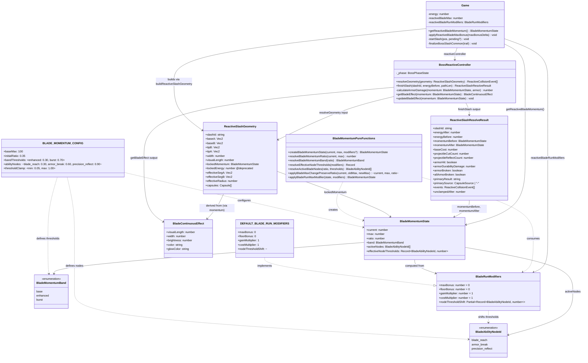
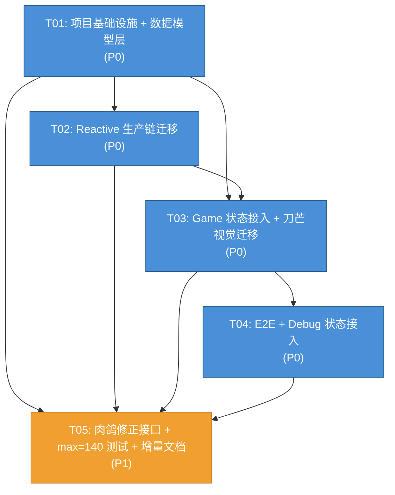

# 《我只要一刀》V0723014 — 系统架构设计与任务分解

> 架构师：高见远 (Bob)  
> 版本：V0723014  
> 日期：2025-07-23

---

## Part A: System Design

### 1. Implementation Approach

#### 1.1 核心技术挑战

| 挑战 | 描述 | 架构对策 |
|---|---|---|
| **绝对值→比例制迁移** | 将硬编码的 `energy>=30/70` 和 `energy/100` 全部替换为 `ratio=current/max → band`，但默认 max=100 时行为必须完全不变 | 新增纯函数层 `bladeMomentum.ts` 做 ratio/band/activeNodes 推导；Controller 和 HUD 逐一切换 |
| **上限成长不掉档** | max 从 100→140 时，current 等比例缩放（80→112），band 不变 | `applyBladeMaxChangePreserveRatio()` 在同一事务中原子更新 current 和 max |
| **档位与能力节点解耦** | burst 档=70%+，但 precision_reflect 节点=90%+，两者独立 | 分别建模：`bandThresholds` 和 `abilityNodes` 两套配置，`activeNodes` 独立推导 |
| **current 单源原则** | 禁止同时存在 `energy` 和 `reactiveBladeCurrent` 双源 | `Game.energy` 保持唯一权威值；新增 `getReactiveBladeMomentum()` 只读快照方法 |
| **锁定快照升级** | `lockedEnergy: number` → `lockedMomentum: BladeMomentumState` | Geometry/pendingSlash 结构升级；过渡期用 `@deprecated` 标记旧字段 |

#### 1.2 技术栈确认（无新增依赖）

沿用现有技术栈，本轮不引入任何新依赖：

- **运行时**: React 19 + TypeScript 5.7
- **Canvas 渲染**: 原生 Canvas 2D API（无第三方渲染库）
- **构建**: Vite 6
- **测试**: Vitest 4 + Playwright 1.61
- **类型系统**: TypeScript strict mode

#### 1.3 架构模式

- **纯函数 + 配置驱动**: `bladeMomentum.ts` (systems) 作为纯函数层，不持有状态，所有函数可独立单元测试
- **单一权威源**: `Game.energy` 是 current 唯一读写入口；`Game.reactiveBladeMax` + `Game.reactiveBladeRunModifiers` 提供 max 和 modifiers
- **快照模式**: 起刀时调用 `getReactiveBladeMomentum()` 锁定完整 `BladeMomentumState`，整刀使用快照判定
- **Controller 集中结算**: `BossReactiveController` 负责所有 ratio→band→damage/reflect 判定，Game 只调接口

---

### 2. File List

#### 2.1 新增文件

| 相对路径 | 内容 | 改动量 |
|---|---|---|
| `src/game/config/bladeMomentum.ts` | 三档刀势配置：BLADE_MOMENTUM_CONFIG（baseMax/initialRatio/bandThresholds/abilityNodes/thresholdClamp） | ~30 行 |
| `src/game/systems/bladeMomentum.ts` | 纯函数：createBladeMomentumState, resolveRatio, resolveBand, resolveActiveNodes, applyBladeMaxChangePreserveRatio, resolveEffectiveNodeThresholds, applyBladeRunMaxModifier | ~120 行 |
| `src/game/systems/bladeMomentum.test.ts` | 单元测试：ratio 边界、band 判定、非法输入、能力节点、上限成长保持 ratio、默认等价矩阵 | ~300 行 |
| `docs/incremental-design-V0723014.md` | 增量设计记录 | ~50 行 |

#### 2.2 修改文件

| 相对路径 | 改动内容 | 改动量 |
|---|---|---|
| `src/version.ts` | `APP_VERSION` → `"V0723014"`，`BUILD_VERSION` → `"0723.014"` | 2 行 |
| `package.json` | `version` → `"0723.014"` | 1 行 |
| `package-lock.json` | 同步 version | 自动生成 |
| `index.html` | title 含版本号更新 | 1 行 |
| `README.md` | 版本号更新 | 1 行 |
| `src/App.tsx` | 无实质性改动（版本号引用自动更新） | 0~1 行 |
| `src/game/config/bossReactiveFlow.ts` | 删除 `bladeEnergy.max` 和 `bladeEnergy.initial`（迁移到 bladeMomentum.ts）；保留 rewards/penalty | ~4 行删除 |
| `src/game/Game.ts` | 新增 `reactiveBladeMax`、`reactiveBladeRunModifiers` 字段；新增 `getReactiveBladeMomentum()` 方法；`energy` 初始化改用 `BLADE_MOMENTUM_CONFIG`；`startSlash` 中 lockedMomentum 快照；`finalizeBossSlashCommon` 中 energy clamp 改用 momentumBefore.max；`drawReactiveDebugOverlay` 新增 momentum 面板；`getState()` 新增 bladeMomentum 只读字段 | ~80 行 |
| `src/game/systems/BossReactiveController.ts` | `resolveGeometry`: `slashEnergy>=70` → `lockedMomentum.band==="burst"`；`calculateArmorDamage`: 改用 band switch；`getBladeEffect`: 改用 ratio+band；`finishSlash`: 新增 `momentumBefore/momentumAfter` 到结果；energy clamp 从 `cfg.max` → `momentumBefore.max` | ~40 行 |
| `src/game/systems/BossReactiveController.test.ts` | 新增 band 判定测试、旧行为兼容矩阵、momentum 不变量测试 | ~80 行 |
| `src/game/systems/reactiveSlashGeometry.ts` | `lockedEnergy` → `lockedMomentum: BladeMomentumState`；`lockedEnergy` 标记 `@deprecated`，由 `lockedMomentum.current` 派生 | ~15 行 |
| `src/game/systems/reactiveSlashGeometry.test.ts` | 适配 lockedMomentum 类型变更 | ~10 行 |
| `src/game/systems/bossReactiveHUD.ts` | `drawEnergyBar`: 改用 momentum 参数（接受 max 非 100）；颜色按 band 读取而非 ratio 硬编码阈值 | ~15 行 |
| `src/game/types.ts` | 新增 `BladeMomentumBand`、`BladeAbilityNodeId`、`BladeMomentumState`、`BladeRunModifiers` 类型导入（或 re-export） | ~5 行 |
| `e2e/boss-reactive-real-input.spec.ts` | `getState()` 新增 `bladeMomentum` 只读断言（current/max/ratio/band） | ~15 行 |
| `e2e/boss-reactive-full-pointer.spec.ts` | 同上新增只读断言 | ~15 行 |
| `src/game/systems/bladeEnergySystem.ts` | `recoverEnergy` 和 `gainEnergyByAction` 中硬编码 `100` → 接受 `maxEnergy` 参数（默认 100） | ~5 行 |

---

### 3. Data Structures and Interfaces



---

### 4. Program Call Flow

```mermaid
sequenceDiagram
    actor Player
    participant Game
    participant RGeometry as buildReactiveSlashGeometry
    participant RC as BossReactiveController
    participant BMF as bladeMomentum.ts
    participant HUD as bossReactiveHUD

    Note over Player,HUD: ── 起刀阶段 ──

    Player->>Game: handlePointerDown(pos)
    Game->>Game: lockedEnergy = clamp(energy, 0, reactiveBladeMax)
    Game->>BMF: createBladeMomentumState(lockedEnergy, reactiveBladeMax, modifiers)
    BMF-->>Game: lockedMomentum: BladeMomentumState
    Note over Game: pendingSlash = { startPos, lockedMomentum, ... }

    Player->>Game: handlePointerMove → commitPendingSlash → startSlash
    Game->>RC: getBladeEffect(lockedMomentum)
    RC-->>Game: BladeContinuousEffect (visual snapshot)
    Game->>Game: currentSlash.reactiveBladeEffect = effect
    Note over Game: SlashTrail 创建完成，lockedMomentum 已锁定

    Note over Player,HUD: ── 刀路延伸阶段（每帧） ──

    Player->>Game: extendSlash(nextPos)
    Game->>RGeometry: buildReactiveSlashGeometry(baseA,baseB,angle,visualLength,width,slashId,**lockedMomentum**)
    RGeometry-->>Game: ReactiveSlashGeometry (3 capsules)
    Game->>RC: resolveGeometry(geometry)

    alt band === "burst" (≥70%)
        RC->>RC: reflective 弹幕 → reflect
    else band === "enhanced" (30-69%) or "base" (<30%)
        RC->>RC: reflective 弹幕 → cut
    end

    RC-->>Game: ReactiveCollisionEvent[] (per-segment)

    Note over Player,HUD: ── 收刀结算 ──

    Player->>Game: handlePointerUp → endSlash → finalizeBossSlashCommon
    Game->>RC: finishSlash(slashId, energyBefore, pathLen)

    RC->>BMF: createBladeMomentumState(energyBefore, max, modifiers)
    BMF-->>RC: momentumBefore

    alt momentumBefore.band === "burst"
        RC->>RC: armorDamage = remainingDurability (一刀破甲)
    else momentumBefore.band === "enhanced"
        RC->>RC: armorDamage = 55
    else momentumBefore.band === "base"
        RC->>RC: armorDamage = 25
    end

    RC->>RC: unclampedEnergy = energyBefore - baseCost + rewards - penalties
    RC->>RC: energyAfter = clamp(unclampedEnergy, floor, momentumBefore.max)
    RC->>BMF: createBladeMomentumState(energyAfter, max, modifiers)
    BMF-->>RC: momentumAfter

    RC-->>Game: ReactiveSlashResolveResult { momentumBefore, momentumAfter, energyAfter, ... }

    Game->>Game: this.energy = result.energyAfter
    Note over Game: 验证: energyAfter == momentumAfter.current

    Note over Player,HUD: ── HUD 更新 ──

    Game->>BMF: getReactiveBladeMomentum() → BladeMomentumState
    Game->>HUD: drawEnergyBar(momentum.current, momentum.max, ...)
    HUD->>HUD: ratio = current/max; color by band
    Game->>Game: drawReactiveDebugOverlay (momentum ratio/band/activeNodes)
```

---

### 5. Anything UNCLEAR

| # | 问题 | 架构层面的回答 / 假设 |
|---|---|---|
| 1 | **lockedEnergy 删除时机** | V0723014 结束前（即本版本）删除，过渡期间标记 `@deprecated`，值从 `lockedMomentum.current` 派生，不得独立设置 |
| 2 | **bossReactiveFlow.bladeEnergy.max/initial 删除后，旧引用处理** | 所有旧 `REACTIVE_BOSS_CONFIG.bladeEnergy.max` 引用改为 `BLADE_MOMENTUM_CONFIG.baseMax + modifiers.maxBonus`；`initial` 改为 `baseMax * initialRatio` |
| 3 | **bladeEnergySystem.ts 中 recoverEnergy/gainEnergyByAction 硬编码 100** | 新增可选 `maxEnergy` 参数，默认值 100（保持普通关卡不变）；Reactive 模式传入 `reactiveBladeMax` |
| 4 | **ReactiveSlashGeometry.lockedEnergy 过渡期兼容** | 类型定义中 `lockedEnergy` 标记 `@deprecated`；`buildReactiveSlashGeometry` 内部从 `lockedMomentum.current` 自动填充；V0723014 结束时物理删除字段 |
| 5 | **ratio 浮点精度** | 内部保留原生浮点不做额外 round；仅在 HUD/Debug 显示时格式化为整数百分比；避免累计误差 |
| 6 | **energyBefore/energyAfter 与 momentumBefore.current/momentumAfter.current 一致性** | 新增 Vitest 不变量测试，强制 `result.energyBefore === result.momentumBefore.current` 和 `result.energyAfter === result.momentumAfter.current` |

---

## Part B: Task Decomposition

### 6. Required Packages

无新增依赖。沿用现有技术栈：
```
- react@^19.0.0: UI framework
- react-dom@^19.0.0: DOM renderer
- typescript@^5.7.2: Type checker
- vite@^6.0.7: Build tool
- @vitejs/plugin-react@^4.3.4: React plugin for Vite
- vitest@^4.1.10: Unit test runner
- @playwright/test@^1.61.1: E2E test runner
- @testing-library/react@^16.3.2: React test utilities
- @testing-library/jest-dom@^7.0.0: DOM matchers
- jsdom@^29.1.1: DOM environment for vitest
```

---

### 7. Task List (ordered by dependency)

#### T01: 项目基础设施 + 数据模型层（P0）

**描述**: 建立 V0723014 版本基线，创建三档刀势配置、类型定义和纯函数层。

**Source Files**:
- `src/version.ts` — 版本号更新至 V0723014/0723.014
- `package.json` — version 同步
- `package-lock.json` — lock 同步
- `index.html` — title 版本号
- `README.md` — 版本号
- `src/game/config/bladeMomentum.ts` — **新增**: BLADE_MOMENTUM_CONFIG + BladeRunModifiers + DEFAULT_BLADE_RUN_MODIFIERS
- `src/game/types.ts` — 新增 BladeMomentumBand / BladeAbilityNodeId / BladeMomentumState / BladeRunModifiers 类型定义
- `src/game/systems/bladeMomentum.ts` — **新增**: 全部纯函数（createBladeMomentumState / resolveRatio / resolveBand / resolveActiveNodes / applyBladeMaxChangePreserveRatio / resolveEffectiveNodeThresholds / applyBladeRunMaxModifier）
- `src/game/systems/bladeMomentum.test.ts` — **新增**: 全部单元测试（ratio 边界/band 判定/非法输入/能力节点/上限成长保持 ratio/默认等价矩阵）
- `src/game/config/bossReactiveFlow.ts` — 删除 `bladeEnergy.max` 和 `bladeEnergy.initial` 字段

**Dependencies**: 无（基线任务）

**Priority**: P0

---

#### T02: Reactive 生产链迁移（Controller + Geometry + bladeEnergySystem）（P0）

**描述**: 将 BossReactiveController 的反射判定、护甲伤害、刀势效果、能量结算 clamp 全部从绝对值迁移为 band/ratio 判定。同时迁移 ReactiveSlashGeometry 的 lockedEnergy → lockedMomentum。

**Source Files**:
- `src/game/systems/BossReactiveController.ts` — resolveGeometry: `slashEnergy>=70` → band==="burst"; calculateArmorDamage: switch(band); getBladeEffect: ratio+band 替代 energy/100 和 energy<30/70; finishSlash: 新增 momentumBefore/momentumAfter 字段，clamp 上限从 cfg.max → momentumBefore.max; updateBladeEffect 接受 BladeMomentumState
- `src/game/systems/BossReactiveController.test.ts` — 新增 band 判定兼容矩阵测试、momentum 不变量测试
- `src/game/systems/reactiveSlashGeometry.ts` — `lockedEnergy` → `lockedMomentum: BladeMomentumState`; 旧 `lockedEnergy` 标记 `@deprecated` 并从 `lockedMomentum.current` 派生
- `src/game/systems/reactiveSlashGeometry.test.ts` — 适配 lockedMomentum 类型变更
- `src/game/systems/bladeEnergySystem.ts` — `recoverEnergy` / `gainEnergyByAction` 新增可选 `maxEnergy` 参数（默认 100）

**Dependencies**: T01（需要 bladeMomentum 类型和配置）

**Priority**: P0

---

#### T03: Game 状态接入 + 刀芒视觉迁移（P0）

**描述**: Game.ts 中新增 `reactiveBladeMax` 和 `reactiveBladeRunModifiers` 字段；实现 `getReactiveBladeMomentum()` 统一快照方法；`startSlash` 改用 lockedMomentum；`finalizeBossSlashCommon` 适配新结果字段。bossReactiveHUD 的 drawEnergyBar 迁移为接受 momentum 参数（max 非 100，颜色按 band 读取）。

**Source Files**:
- `src/game/Game.ts` — 新增 reactiveBladeMax / reactiveBladeRunModifiers 字���；构造函数中 energy 初始化改用 BLADE_MOMENTUM_CONFIG；新增 getReactiveBladeMomentum() 方法；startSlash 构建 lockedMomentum 快照存入 pendingSlash；finalizeBossSlashCommon 适配 momentumBefore/momentumAfter；drawReactiveDebugOverlay 新增 momentum 面板（ratio/band/activeNodes/nodeThresholds/runModifiers）；getState() 新增 bladeMomentum 只读字段
- `src/game/systems/bossReactiveHUD.ts` — drawEnergyBar 参数从 `(energy, maxEnergy)` 改为接受 `momentum: BladeMomentumState`；颜色切换改用 `momentum.band`；文字显示改为 `current/max` 格式

**Dependencies**: T02（需要 Controller 和 Geometry 已完成迁移）

**Priority**: P0

---

#### T04: E2E + Debug 状态接入（P0）

**描述**: E2E 测试新增 bladeMomentum 只读断言（开局 current=35/max=100/ratio=0.35/band=enhanced，全程 0≤current≤max）；Debug 面板展示完整 momentum 遥测数据。运行 CI 验证全绿。

**Source Files**:
- `e2e/boss-reactive-real-input.spec.ts` — getState() 新增 bladeMomentum 只读断言；开局快照验证
- `e2e/boss-reactive-full-pointer.spec.ts` — 同上新增只读断言；全流程 ratio 一致性验证
- `src/App.tsx` — 无实质改动（引用版本号可能自动更新）

**Dependencies**: T03（需要 Game 的 getState() 已返回 bladeMomentum）

**Priority**: P0

---

#### T05: 肉鸽修正接口 + max=140 测试环境 + 增量设计文档（P1）

**描述**: BladeRunModifiers 正式接入 Game 构造流程（默认值为空）；applyBladeRunMaxModifier 和 applyBladeMaxChangePreserveRatio 通过 Vitest 验证 max=140/180 场景；创建增量设计文档。

**Source Files**:
- `src/game/Game.ts` — applyReactiveBladeMaxBonus 方法（本轮仅测试用，不接入真实流程）
- `src/game/systems/bladeMomentum.test.ts` — 扩展测试：max=140（42/140→enhanced, 98/140→burst, 126/140→precision_reflect 激活）；max=180（54/180→enhanced, 126/180→burst）；modifiers.nodeThresholdShift 测试；thresholdClamp 边界测试
- `docs/incremental-design-V0723014.md` — **新增**: 增量设计记录

**Dependencies**: T01-T04 全部完成

**Priority**: P1

---

### 8. Shared Knowledge

跨文件约定，工程师实现时必须遵守：

```text
【ratio 范围】
- 内部计算: 0.0 ~ 1.0（浮点，不做额外 round）
- HUD/Debug 显示: 整数百分比（如 "35%"）
- current/max 显示: 最多 1 位小数

【band 三档语义】
- "base":      ratio < 0.30  — 基础处理（护甲伤害 25，不能反射）
- "enhanced":  0.30 ≤ ratio < 0.70 — 强化处理（护甲伤害 55，不能反射）
- "burst":     ratio ≥ 0.70 — 爆发处理（直接破甲，可以反射）

【activeNodes 排序规则】
固定顺序: blade_reach → armor_break → precision_reflect
（按阈值从低到高排列，确保 Debug 输出稳定可读）

【energy 单源原则】
- Game.energy 是 current 唯一权威值
- 禁止创建 reactiveBladeCurrent 或任何第二份 current 副本
- getReactiveBladeMomentum() 只是只读快照，写入必须走 Game.energy

【旧字段删除时机】
- lockedEnergy: V0723014 结束前删除，过渡期标记 @deprecated，值从 lockedMomentum.current 派生
- bossReactiveFlow.bladeEnergy.max/initial: T01 中删除，所有引用迁移到 BLADE_MOMENTUM_CONFIG

【energyBefore/energyAfter 不变量】
- result.energyBefore === result.momentumBefore.current（强制，有 Vitest 测试保护）
- result.energyAfter === result.momentumAfter.current（强制，有 Vitest 测试保护）
- 0 ≤ momentumAfter.current ≤ momentumAfter.max

【默认等价性】
- max=100, initial=35 下，所有战斗结果（伤害值、反射行为、破甲次数、颜色）必须与 V0723013 完全一致
- 任何偏离都是 bug，不是特性

【禁止改动边界】
- 普通关卡完全不动（energy 初始化、recoverEnergy、canSlash 均保持不变）
- Boss 弹幕/护甲/Boss时长/玩家HP 等数值完全不调
- precision_reflect 90% 节点只建数据不应用行为
```

---

### 9. Task Dependency Graph



**说明**: T01→T02→T03→T04 构成 P0 关键路径；T05 为 P1，依赖全部 P0 完成后执行。

---

## 附录: 架构决策记录 (ADR)

### ADR-001: 为什么不是新建 `BladeMomentumService` 类？

**决策**: 纯函数模块而非服务类。

**理由**: 
- 刀势状态推导是纯计算（input → output），无副作用、无异步、无外部依赖
- 纯函数可被 Game/Controller/HUD/Test 任意位置调用，无需依赖注入
- Vitest 测试零 mock 开销
- 避免引入"刀势服务"与"Controller"的职责边界模糊

### ADR-002: 为什么 lockedMomentum 存在 Geometry 中而非单独传递？

**决策**: lockedMomentum 作为 ReactiveSlashGeometry 的一级字段。

**理由**:
- 一刀的完整上下文 = 空间几何 + 刀势状态，两者不可分割
- Controller.resolveGeometry 和 finishSlash 都需要 momentum 做判定，统一入口避免参数漂移
- 未来扩展（如 band 影响碰撞半径）无需修改调用链签名
