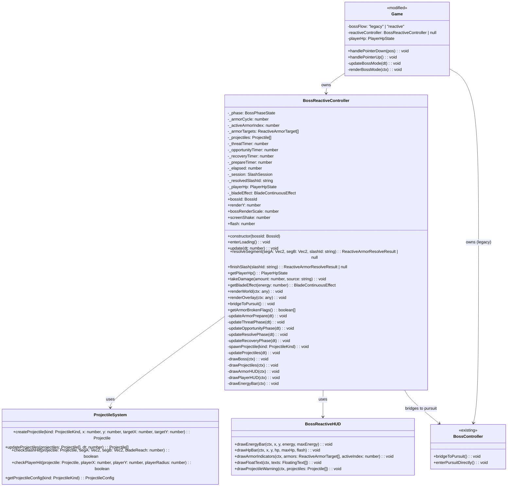
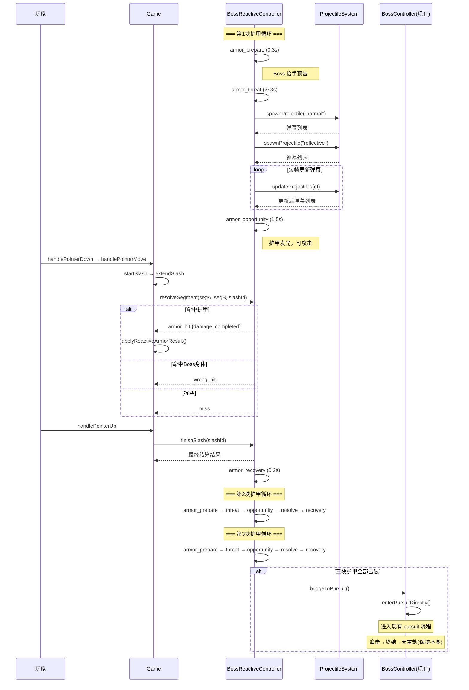
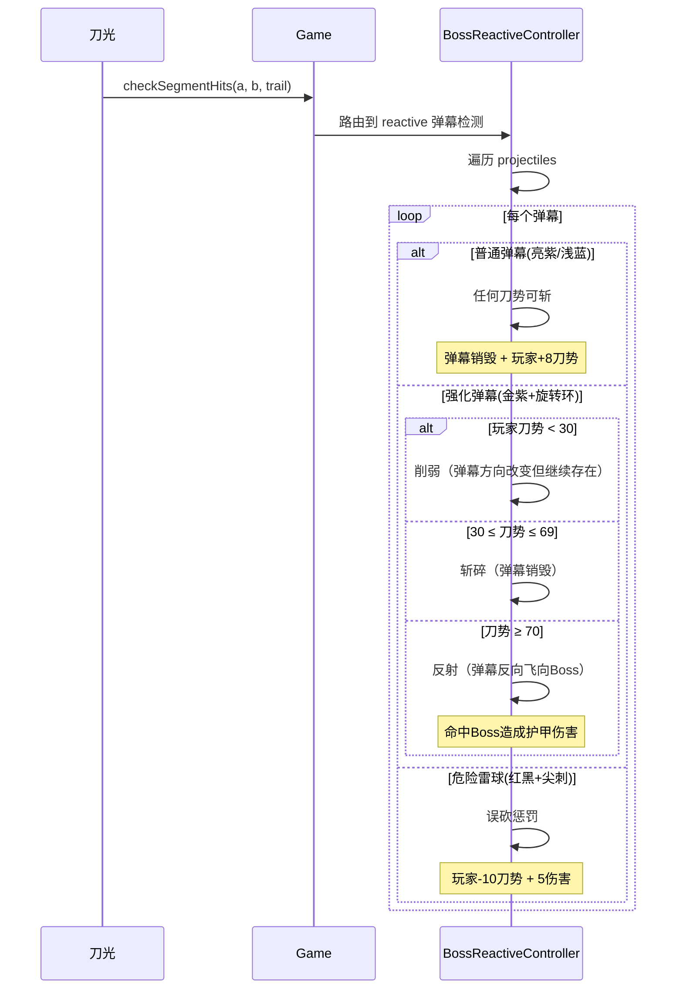
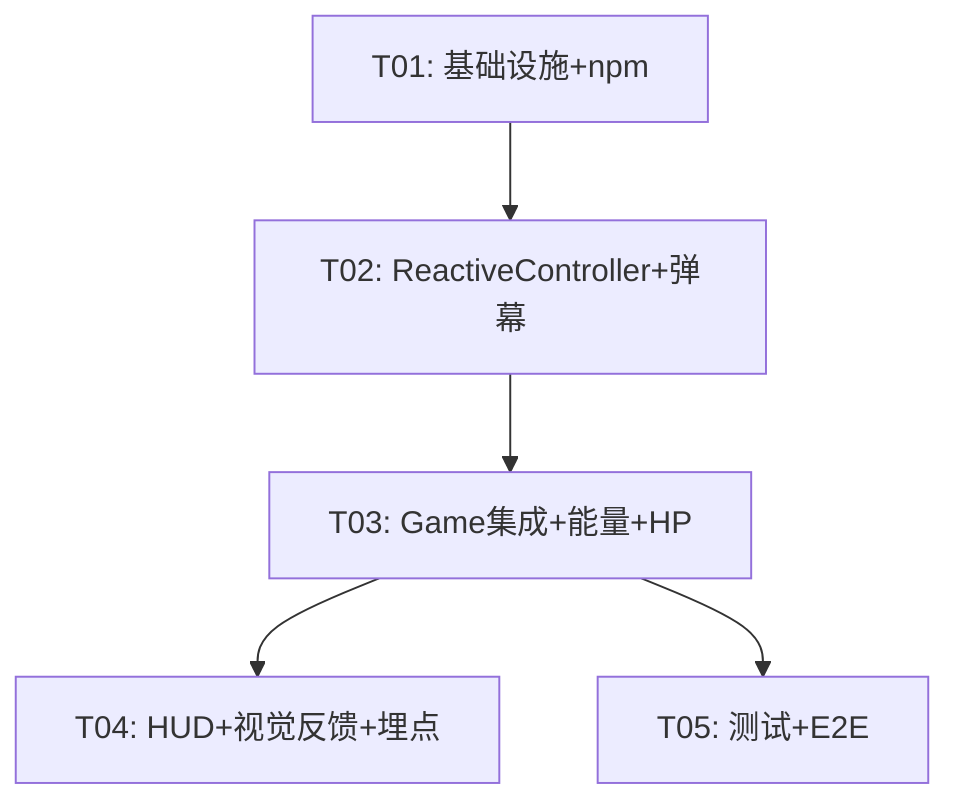

# 《我只要一刀》增量系统架构设计 — 破甲阶段重构（reactive flow）

> 架构师：高见远 | 版本：V0722008 → V0722009 | 日期：2025-07-22

---

## 1. 实现方案 + 框架选型

### 1.1 整体技术方案（增量改造策略）

**原则：只重构破甲阶段，不碰追击/终结/天雷劫。**

现有 BossController 管理完整的 armor → pursuit → execution → tribulation 全流程。本次在旁新增 `BossReactiveController`，专门处理新破甲阶段。当 3 块护甲全部击破后，**桥接回现有 BossController 的 pursuit 阶段**，复用后续全流程。

```
┌─────────────────────────────────────────────────────────────────────┐
│  BossController (现有)                                              │
│  armor → armor_break_show → armor_complete_hold → pursuit → ...    │
│              ↑                          ↓                          │
│              │                    [保持不变]                        │
│              │                                                      │
│  BossReactiveController (新增)                                       │
│  armor_prepare → threat → opportunity → resolve → recovery × 3    │
│        ↓                                                           │
│  (桥接回 BossController.pursuit)                                    │
└─────────────────────────────────────────────────────────────────────┘
```

### 1.2 核心技术挑战

| 挑战 | 解决方案 |
|------|----------|
| 弹幕系统与刀光碰撞检测 | 复用现有 `segmentHitCircle` / `segmentHitEllipse`，新增弹幕类型定义 |
| 新旧版本并存 | `?bossFlow=legacy/reactive` URL 参数 + Game 内部路由 |
| 刀势经济重做 | 修改 `bladeEnergySystem.ts`：`canSlash` 永远返回 true，正向行为回能 |
| 玩家生命系统 | Game 类新增 `playerHp` / `playerMaxHp`，与现有 `hp` 系统隔离 |
| 刀势连续视觉效果 | 刀芒长度/宽度基于 `energy/100` 连续缩放，不再依赖刀势段位阶梯 |

### 1.3 框架与库

| 用途 | 选择 | 理由 |
|------|------|------|
| UI 框架 | React 19 + TypeScript | 现有技术栈，不变 |
| 构建工具 | Vite 6 | 现有技术栈，不变 |
| 测试 | Vitest + Playwright | 现有技术栈，不变 |
| Canvas 渲染 | 原生 Canvas 2D | 现有技术栈，不变 |
| 新增依赖 | 无 | 全部使用现有能力实现 |

### 1.4 新旧版本并存策略（`?bossFlow=legacy/reactive`）

```
?bossFlow=legacy     → 使用现有 BossController 完整流程（不变）
?bossFlow=reactive   → 使用 BossReactiveController 处理破甲阶段
无参数               → 默认 legacy（向后兼容）
```

**实现方式：**
- `App.tsx` 从 URL 读取 `bossFlow` 参数，通过 `GameCanvas` 的 props 传入
- `GameCanvas` 将参数传给 `Game` 构造函数
- `Game` 在 `initializeThunderGeneralBoss` 时根据参数选择控制器
- 两个控制器共享同一个 `BossPhaseState` 类型，但 reactive 阶段使用新状态名

---

## 2. 文件列表

### 2.1 新建文件

| 文件路径 | 用途 |
|----------|------|
| `src/game/config/bossReactiveFlow.ts` | **配置中心**：新破甲阶段全部数值常量、弹幕配置、刀势经济参数 |
| `src/game/systems/BossReactiveController.ts` | **核心控制器**：新 5 状态机 + 弹幕生成 + 护甲判定 + 渲染 |
| `src/game/systems/projectileSystem.ts` | **弹幕系统**：弹幕运动更新、碰撞检测、生命周期管理 |
| `src/game/systems/bossReactiveHUD.ts` | **HUD 渲染**：刀势条、生命条、护甲状态指示器 |
| `src/game/systems/BossReactiveController.test.ts` | **单元测试**：新控制器的全部测试用例 |

### 2.2 修改文件

| 文件路径 | 修改内容 |
|----------|----------|
| `src/game/types.ts` | 新增 `BossPhaseState` 枚举值（reactive 子状态）、`Projectile` 类型、`ProjectileKind`、`PlayerHpState` |
| `src/game/Game.ts` | 双入口路由、HP 系统、能量经济重构、渲染适配、BossReactiveController 集成 |
| `src/game/systems/bladeEnergySystem.ts` | `canSlash` 永远返回 true、新增正向回能函数、被动回能降为 1.5/s |
| `src/game/config/balance.ts` | 新增 `playerHp`、`reactiveBladeEnergy` 等配置段 |
| `src/game/systems/BossController.ts` | 新增 `bridgeToPursuit()` 方法供 reactive 控制器桥接调用 |
| `src/game/GameCanvas.tsx` | 传递 `bossFlow` prop 到 Game |
| `src/App.tsx` | 从 URL 解析 `bossFlow` 参数并传入 GameCanvas |
| `src/game/systems/BossController.test.ts` | 新增桥接测试（保持现有测试不变） |

---

## 3. 数据结构与接口

### 3.1 关键 TypeScript 类型定义

```typescript
// ---- 新增弹幕类型 ----
export type ProjectileKind = "normal" | "reflective" | "dangerous";

export type Projectile = {
  id: string;
  kind: ProjectileKind;
  x: number;
  y: number;
  vx: number;
  vy: number;
  radius: number;
  active: boolean;
  /** 生成时间（用于生命周期判断） */
  spawnTime: number;
  /** 最大存活时间 */
  maxLife: number;
  /** 旋转角度（用于 reflective 视觉效果） */
  rotation: number;
  /** 旋转速度 */
  rotationSpeed: number;
  /** 颜色主色 */
  color: string;
  /** 发光颜色 */
  glowColor: string;
  /** 已反射标记 */
  reflected: boolean;
};

// ---- 新破甲阶段状态机 ----
// 扩展 BossPhaseState 新增值:
// "armor_prepare" | "armor_threat" | "armor_opportunity" | "armor_resolve" | "armor_recovery"

// ---- 新护甲目标 ----
export type ReactiveArmorTarget = {
  id: number;
  name: string;
  relX: number;
  relY: number;
  radiusX: number;
  radiusY: number;
  /** 当前是否激活（可被攻击） */
  active: boolean;
  /** 是否已破碎 */
  broken: boolean;
  /** 当前耐久 */
  durability: number;
  /** 最大耐久 */
  maxDurability: number;
  /** 累积裂痕值（低刀势累积） */
  crackProgress: number;
  /** 动画计时器 */
  animTimer: number;
  /** 绑定的弹幕类型 */
  projectileKind: ProjectileKind;
  /** Boss 动作（绑定到该护甲） */
  bossAction: "sweep" | "reflect" | "mixed";
};

// ---- 玩家生命状态 ----
export type PlayerHpState = {
  current: number;
  max: number;
  /** 受伤无敌计时 */
  invincibleTimer: number;
  /** 受伤闪白计时 */
  flashTimer: number;
};

// ---- 刀势连续效果参数 ----
export type BladeContinuousEffect = {
  /** 刀芒长度 (30~130) */
  visualLength: number;
  /** 刀芒宽度 (3~20) */
  width: number;
  /** 亮度 (0.3~1.2) */
  brightness: number;
  /** 颜色（渐变插值） */
  color: string;
  /** 发光颜色 */
  glowColor: string;
};
```

### 3.2 Mermaid 类图



---

## 4. 程序调用流程

### 4.1 新破甲状态机时序



### 4.2 弹幕碰撞处理流程



---

## 5. Anything UNCLEAR — 待明确事项

1. **Boss 动作空间变化**（P2）：PRD 提到"Boss 动作空间变化"，但未明确是视觉位移还是判定区域变化。假设为：Threat 阶段 Boss 在 X 轴 ±30px 范围内缓慢平移，增加弹幕落点变化。
2. **弹幕生成频率与数量**：PRD 未给出具体数值。假设：每块护甲的 threat 阶段持续 2~3 秒，生成 2~4 枚弹幕，其中普通弹幕占 60%、强化 30%、危险 10%。
3. **刀势飘字具体样式**（P2）：PRD 未指定字体大小/颜色/动画。假设：+8 绿字、-10 红字、+16 金字，浮动 0.6 秒后淡出。
4. **数据采集埋点维度**（P1）：PRD 未指定具体事件。假设：记录弹幕命中次数、反射次数、误砍次数、单块护甲完成时间、总破甲时间。
5. **护甲裂痕（crack）累计机制**：低刀势(0~29)每次命中累积 25 裂痕，多次累加可破甲，但需要明确裂痕阈值。假设：每块护甲耐久 100，裂痕满 100 时自动转为 1 次有效攻击。

---

## 6. 任务列表

### 6.1 所需包

无新增 npm 包。所有能力使用现有技术栈实现。

### 6.2 任务列表（按依赖顺序）

| 任务 ID | 任务名称 | 源文件 | 依赖 | 优先级 |
|---------|---------|--------|------|--------|
| T01 | 项目基础设施：配置中心 + 类型定义 + 双入口路由 | `bossReactiveFlow.ts`, `types.ts`, `balance.ts`, `App.tsx`, `GameCanvas.tsx`, `vite.config.ts` | 无 | P0 |
| T02 | BossReactiveController：5状态机 + 弹幕系统 + 护甲判定 + 渲染 | `BossReactiveController.ts`, `projectileSystem.ts`, `bossReactiveHUD.ts`, `BossController.ts` | T01 | P0 |
| T03 | Game 集成：能量经济重构 + 玩家生命系统 + 刀势连续效果 + 流路由 | `Game.ts`, `bladeEnergySystem.ts` | T02 | P0 |
| T04 | 视觉反馈：HUD 渲染 + 飘字 + 数据采集埋点 + 护甲状态指示 | `bossReactiveHUD.ts`（补充）、`Game.ts`（渲染集成） | T03 | P1 |
| T05 | 测试：15项单元测试 + 6项E2E测试 + E2E桥接适配 | `BossReactiveController.test.ts`, `BossController.test.ts`, `boss-smoke.spec.ts` | T03 | P1 |

### 6.3 任务依赖图



---

## 7. 任务详情

### T01: 项目基础设施 — 配置中心 + 类型定义 + 双入口路由

**说明：** 创建新破甲阶段的集中配置中心，定义所有新类型，建立 `?bossFlow=legacy/reactive` 双入口路由。

**新建文件：**
- `src/game/config/bossReactiveFlow.ts` — 全部数值常量（弹幕速度/半径/颜色、刀势经济参数、HP 参数、状态机计时器）
- `src/game/types.ts` — 追加新增类型定义（见第 3 节）

**修改文件：**
- `src/game/config/balance.ts` — 新增 `playerHp`、`reactiveBladeEnergy` 配置段
- `src/App.tsx` — 从 `window.location.search` 解析 `bossFlow` 参数，通过 props 传入 `GameCanvas`
- `src/game/GameCanvas.tsx` — 接收 `bossFlow` prop，传递给 Game 构造函数
- `src/game/Game.ts` — 构造函数接收 `bossFlow` 参数，存储为 `this.bossFlow`
- `vite.config.ts` — 新增 `__BOSS_FLOW__` 编译常量（可选，用于 tree-shaking）

**关键产出：** `bossReactiveFlow.ts` 配置内容示例：

```typescript
export const REACTIVE_BOSS_CONFIG = {
  // 状态机计时
  phaseTimers: {
    armorPrepare: 0.3,
    threatDuration: [2.0, 3.0],  // 随机范围
    opportunityDuration: 1.5,
    recoveryDuration: 0.2,
  },
  // 刀势经济
  bladeEnergy: {
    max: 100,
    initial: 35,
    passiveRegenPerSecond: 1.5,
    shortSlashCost: 7,
    longSlashBonus: 3,      // 长刀 +3
    emptySwingPenalty: 4,   // 空挥惩罚 +4
    wrongHitPenalty: 10,    // 误砍 -10
    normalBulletReward: 8,  // 普弹 +8
    reflectReward: 16,      // 反射 +16
    armorCrackReward: 5,    // 护甲裂痕 +5
    armorBreakReward: 22,   // 破甲 +22
  },
  // 玩家生命
  playerHp: {
    max: 100,
    normalBulletDamage: 6,
    reflectiveBulletDamage: 12,
    bossHeavyDamage: 20,
    mistakenCutDamage: 5,
    invincibleDuration: 0.3,
  },
  // 护甲
  armor: {
    durabilityPerPiece: 100,
    lowEnergyCrack: 25,      // 0~29 刀势
    midEnergyDamage: 55,     // 30~69 刀势
    highEnergyOneShot: 100,  // 70~100 刀势
    damageFormula: "20 + energy * 0.8",
  },
  // 弹幕
  projectiles: {
    normal: { speed: 120, radius: 10, color: "#9b59b6", glowColor: "rgba(155,89,182,0.6)", maxLife: 4 },
    reflective: { speed: 90, radius: 14, color: "#d4a0ff", glowColor: "rgba(212,160,255,0.7)", maxLife: 5, rotationSpeed: 3 },
    dangerous: { speed: 160, radius: 16, color: "#c0392b", glowColor: "rgba(192,57,43,0.8)", maxLife: 3.5 },
  },
  // 刀势连续效果阈值
  bladeEffect: {
    minLength: 30,
    maxLength: 130,
    minWidth: 3,
    maxWidth: 20,
    minBrightness: 0.3,
    maxBrightness: 1.2,
    lowEnergyColor: "#666666",
    midEnergyColor: "#5bc0ff",
    highEnergyColor: "#fff4a0",
  },
};
```

---

### T02: BossReactiveController — 5状态机 + 弹幕系统 + 护甲判定 + 渲染

**说明：** 实现新破甲阶段的核心控制器，包含完整的 5 状态机、弹幕生成与更新、护甲判定逻辑、渲染方法。

**类结构：**

```
BossReactiveController
├── 状态管理
│   ├── _phase: BossPhaseState (armor_prepare → armor_threat → armor_opportunity → armor_resolve → armor_recovery)
│   ├── _armorCycle: 0..2 (当前第几块护甲)
│   ├── _activeArmorIndex: ARMOR_L | ARMOR_R | ARMOR_C
│   └── _armorTargets: ReactiveArmorTarget[]
├── 弹幕系统
│   ├── _projectiles: Projectile[]
│   ├── spawnProjectile(kind): void
│   └── updateProjectiles(dt): void
├── 护甲判定
│   ├── resolveSegment(segA, segB, slashId): ArmorResolveResult
│   └── finishSlash(slashId): ArmorResolveResult
├── 玩家状态
│   ├── _playerHp: PlayerHpState
│   ├── takeDamage(amount, source): void
│   └── getPlayerHp(): PlayerHpState
├── 刀势效果
│   └── getBladeEffect(energy): BladeContinuousEffect
├── 渲染
│   ├── renderWorld(ctx): void (Boss/弹幕/粒子)
│   └── renderOverlay(ctx): void (HUD/文字/Boss覆盖层)
└── 桥接
    └── bridgeToPursuit(): void → 调用 BossController.enterPursuitDirectly()
```

**新建文件：**
- `src/game/systems/BossReactiveController.ts` — 核心控制器
- `src/game/systems/projectileSystem.ts` — 弹幕系统工具函数
- `src/game/systems/bossReactiveHUD.ts` — HUD 渲染

**修改文件：**
- `src/game/systems/BossController.ts` — 新增 `enterPursuitDirectly()` 方法：
  ```typescript
  /** 被 reactive 控制器桥接调用：跳过 armor 直接进入 pursuit */
  enterPursuitDirectly(): void {
    this._phase = "pursuit_intro";
    this.pursuitIntroTimer = 0;
    this.objectiveText = "趁弱点显现时追击";
    this.objectiveAlpha = 1;
    this._objectiveTimer = 0;
    this._pursuitProgress = 0;
    // 标记所有护甲为已破碎
    this.armorProgress = 3;
    for (const armor of this.armorTargets) {
      armor.active = false;
      armor.broken = true;
    }
  }
  ```

**护甲三块绑定：**

| 护甲 | 弹幕类型 | Boss 动作 |
|------|---------|-----------|
| 左肩 (ARMOR_L) | 普通弹幕 + 横扫 | 普弹从左侧射出，Boss 向右横扫 |
| 右肩 (ARMOR_R) | 强化弹幕 + 反射 | 强化弹幕从右侧射出，Boss 身上出现反射环 |
| 胸甲 (ARMOR_C) | 混合 + 雷球 | 普通弹幕 + 危险雷球混合 |

**5 状态机详细逻辑：**

```
armor_prepare (0.3s)
  → Boss 抬手动画，护甲发光预告
  → 不生成弹幕，玩家可观察
  → 计时结束 → armor_threat

armor_threat (2~3s 随机)
  → 根据护甲类型生成对应弹幕
  → 每 0.6~0.8s 生成一枚新弹幕
  → Boss 做绑定动作（横扫/反射/混合）
  → 弹幕运动方向：从 Boss 位置向玩家区域
  → 计时结束 → armor_opportunity

armor_opportunity (1.5s)
  → 停止生成新弹幕
  → 护甲高亮发光，提示可攻击
  → 玩家挥刀可命中护甲
  → 残留弹幕继续存在
  → 计时结束 → armor_recovery 或 提前命中护甲即进入 resolve

armor_resolve (瞬时，由玩家挥刀触发)
  → 判定命中结果
  → 计算伤害（基于刀势）
  → 更新护甲耐久
  → 直接进入 armor_recovery

armor_recovery (0.2s)
  → Boss 后退复位
  → 清理残留弹幕
  → 如果还有下一块护甲 → armor_prepare
  → 如果三块全部击破 → bridgeToPursuit()
```

---

### T03: Game 集成 — 能量经济重构 + 玩家生命系统 + 刀势连续效果 + 流路由

**说明：** 将 BossReactiveController 集成到 Game 主循环中，重构能量系统，新增玩家生命系统。

**修改文件：**
- `src/game/Game.ts` — 主要集成点

**Game.ts 修改要点：**

1. **构造函数新增参数：** `bossFlow: "legacy" | "reactive" = "legacy"`

2. **initializeThunderGeneralBoss 分支：**
   ```typescript
   if (this.bossFlow === "reactive") {
     this.reactiveController = new BossReactiveController("thunderGeneral");
     this.reactiveController.enterLoading();
   } else {
     this.bossController = new BossController("thunderGeneral");
     this.bossController.enterLoading();
   }
   ```

3. **updateBossMode 分支：**
   ```typescript
   if (this.bossFlow === "reactive" && this.reactiveController) {
     this.updateReactiveBossMode(scaledDt, frameDt);
     return;
   }
   ```

4. **updateReactiveBossMode 方法：** 类似 updateBossMode 但使用 reactiveController

5. **checkSegmentHits 新增路由：**
   ```typescript
   if (this.gameMode === "boss" && this.bossFlow === "reactive" && this.reactiveController) {
     // 路由到 reactive 弹幕检测 + 护甲判定
     this.reactiveController.resolveSegment(a, b, trail.id);
     // 同时检测弹幕碰撞
     this.checkReactiveProjectileHits(a, b, trail);
     return;
   }
   ```

6. **endSlash 方法：** reactive 模式下路由到 `reactiveController.finishSlash`

7. **handlePointerDown 修改：** reactive 模式下移除 `canSlash` 检查（永远可挥刀）

8. **能量系统改造：**
   - `recoverEnergy` 被动回能降为 1.5/s
   - 新增 `gainEnergyByAction(amount)` 方法
   - 每次挥刀根据刀路长度消耗/奖励

9. **玩家生命系统：**
   ```typescript
   private playerHp: PlayerHpState = { current: 100, max: 100, invincibleTimer: 0, flashTimer: 0 };
   ```
   - 弹幕命中玩家时调用 `playerHp.takeDamage`
   - 误砍时调用 `playerHp.takeDamage(5, "mistaken_cut")`
   - HP 归零 → 游戏结束

10. **刀势连续效果渲染：**
    - 在 `startSlash` 时根据 `energy/100` 计算连续效果
    - 刀芒长度 = lerp(30, 130, energy/100)
    - 刀芒宽度 = lerp(3, 20, energy/100)
    - 亮度 = lerp(0.3, 1.2, energy/100)
    - 颜色渐变：灰→蓝→金

**修改文件：**
- `src/game/systems/bladeEnergySystem.ts`:
  - `canSlash()` 在 reactive 模式下永远返回 true
  - 新增 `gainEnergy(energy, amount)` 辅助函数
  - `recoverEnergy` 新增 `reactiveMode` 参数，开启时使用 1.5/s

---

### T04: 视觉反馈 — HUD 渲染 + 飘字 + 数据采集埋点 + 护甲状态指示

**说明：** 实现新破甲阶段的完整 HUD 视觉反馈，包括刀势条、生命条、护甲状态指示、飘字反馈、数据采集。

**文件：**
- `src/game/systems/bossReactiveHUD.ts` — 补充完整 HUD 渲染方法

**HUD 布局（从上到下）：**

```
┌─────────────────────────────────────┐
│  ❤ 100/100      ⚡ 35/100          │  ← 生命条 + 刀势条
│  ████████░░░░░░░  ███████░░░░░░░░  │
│                                     │
│  护甲状态: [●] [◉] [○]              │  ← 三块护甲（◉=当前激活）
│  左肩(普弹)  右肩(强化)  胸甲(混合)  │
│                                     │
│  提示: "切发亮护甲"                  │  ← 目标提示
└─────────────────────────────────────┘
```

**飘字系统：**
- 普通弹幕斩碎: `+8 刀势` (绿色, 16px, 0.6s)
- 强化弹幕反射: `+16 刀势` (金色, 20px, 0.8s)
- 危险雷球误砍: `-10 刀势 -5HP` (红色, 18px, 0.8s)
- 护甲命中: `破甲! +22` (金色, 22px, 0.8s)
- 护甲裂痕: `裂痕 +25` (紫色, 16px, 0.5s)

**数据采集埋点（P1）：**
```typescript
logEvent("reactive_armor_hit", { armorId, energy, damage, cycleIndex });
logEvent("reactive_projectile_cut", { projectileKind, energy });
logEvent("reactive_projectile_reflect", { energy });
logEvent("reactive_mistaken_cut", { energy, hpLoss });
logEvent("reactive_armor_complete", { totalTime, totalSlashCount });
logEvent("reactive_player_hp_loss", { amount, source, remainingHp });
```

---

### T05: 测试 — 15项单元测试 + 6项E2E测试 + E2E桥接适配

**说明：** 为 BossReactiveController 编写完整的单元测试套件，补充 E2E 测试，更新 E2E 桥接。

**单元测试（15项）：**

| # | 测试名称 | 描述 |
|---|---------|------|
| 1 | 初始状态为 armor_prepare | 验证 skipIntro 后进入 armor_prepare |
| 2 | 5 状态机完整流转 | 单块护甲经历全部 5 状态 |
| 3 | 三块护甲循环 | 3 次循环后进入 bridgeToPursuit |
| 4 | 普通弹幕可被任何刀势斩碎 | 任意能量挥刀命中普通弹幕 → 销毁 |
| 5 | 强化弹幕三档处理 | <30 削弱 / 30~69 斩碎 / ≥70 反射 |
| 6 | 危险雷球误砍惩罚 | 命中雷球 → -10 刀势 + 5 伤害 |
| 7 | 护甲伤害公式验证 | 高刀势(70+) 一刀破甲，中刀势(30~69) 55 伤害 |
| 8 | 护甲裂痕累积 | 低刀势(0~29)多次命中累积裂痕满 100 破甲 |
| 9 | 刀势经济正反馈 | 斩碎弹幕 +8，反射 +16，破甲 +22 |
| 10 | 被动回能 1.5/s | 空闲时每秒恢复 1.5 |
| 11 | 玩家生命系统 | 受伤扣血，无敌计时，归零检查 |
| 12 | 刀势连续效果插值 | energy=0→min, energy=100→max |
| 13 | 弹幕生命周期 | 弹幕超出 maxLife 自动销毁 |
| 14 | 桥接到 pursuit | 三块护甲破碎后调用 bridgeToPursuit |
| 15 | 空挥惩罚 | 什么都没命中时 +4 刀势消耗 |

**E2E 测试（6项）：**
1. 完整 reactive 破甲流程（三块护甲依次击破）
2. 弹幕斩碎反馈验证
3. 强化弹幕反射验证
4. 危险雷球误砍惩罚验证
5. 桥接到 pursuit 阶段验证
6. legacy 模式不变验证

**E2E 桥接更新：**
- `__ONE_BLADE_E2E__` 新增 `reactiveController` 暴露
- 新增 `forceReactiveArmorHit` 方法
- 新增 `getReactiveProjectiles` 方法

---

## 8. 共享知识

### 8.1 全局常量/枚举位置

| 常量 | 文件 | 导出名 |
|------|------|--------|
| 新破甲阶段全部数值 | `src/game/config/bossReactiveFlow.ts` | `REACTIVE_BOSS_CONFIG` |
| 弹幕类型枚举 | `src/game/types.ts` | `ProjectileKind` |
| 弹幕接口 | `src/game/types.ts` | `Projectile` |
| 新护甲目标接口 | `src/game/types.ts` | `ReactiveArmorTarget` |
| 玩家生命接口 | `src/game/types.ts` | `PlayerHpState` |
| 刀势连续效果接口 | `src/game/types.ts` | `BladeContinuousEffect` |
| 现有通用配置 | `src/game/config/balance.ts` | `BALANCE` |
| 现有游戏常量 | `src/game/config/constants.ts` | `DESIGN_WIDTH`, `DESIGN_HEIGHT` 等 |

### 8.2 命名约定

- **新文件前缀：** `bossReactive*` 标识属于新破甲阶段
- **状态机阶段前缀：** `armor_*` 标识属于破甲阶段（与现有 `BossPhaseState` 风格一致）
- **弹幕类型：** `ProjectileKind` 枚举值使用小写 `"normal" | "reflective" | "dangerous"`
- **方法命名：** 与现有 BossController 风格一致（camelCase, 动词+名词）

### 8.3 渲染规则

- **渲染层序：** 背景 → 弹幕(世界层) → 刀光 → Boss → 粒子 → HUD(覆盖层)
- **弹幕渲染：** 在 `renderWorld` 中绘制（刀光下方）
- **HUD 渲染：** 在 `renderOverlay` 中绘制（最上层）
- **坐标系统：** 使用 `DESIGN_WIDTH=390, DESIGN_HEIGHT=844` 设计分辨率，GameCanvas 中 DPR 缩放

### 8.4 E2E 桥接约定

- `__E2E_BRIDGE__` 由 vite define 注入，仅 e2e 构建模式开启
- 生产构建下 `if(__E2E_BRIDGE__)` 整段被静态消除
- 新增 `window.__ONE_BLADE_E2E__.reactiveController` 暴露
- 新增 `window.__ONE_BLADE_E2E__.forceReactiveArmorHit()` 和 `getReactiveProjectiles()` 方法

### 8.5 跨文件约定

- 所有 API 响应格式：`{ code, data, message }`（服务端交互，本次不涉及）
- 所有时间以秒为单位（float）
- 所有坐标以设计分辨率（390×844）为基准
- 弹幕 y 方向向下为正（从 Boss 位置向玩家区域）
- 刀势值范围：0~100，整数
- HP 范围：0~100，整数

---

## 9. 待明确事项

1. **弹幕碰撞检测精度**：使用现有 `segmentHitCircle` 还是需要更精确的判定？当前假设复用现有函数。
2. **Boss 动作空间变化的具体实现**：PRD 提到"Boss 动作空间变化"（P2），假设为 Threat 阶段 Boss 在 X 轴 ±30px 范围内缓慢平移。
3. **强化弹幕"反射"的视觉效果**：反射后弹幕反向飞向 Boss，命中 Boss 时触发什么视觉效果？假设为金紫爆炸粒子。
4. **危险雷球"尖刺"视觉**：红黑渐变 + 旋转尖刺，使用 Canvas 多边形绘制。
5. **数据埋点具体维度**：PRD 未指定具体事件名和维度，以上为合理假设，待产品确认。
6. **护甲裂痕累计的 UI 表现**：护甲表面出现裂纹线条，随裂痕值增加而增多。