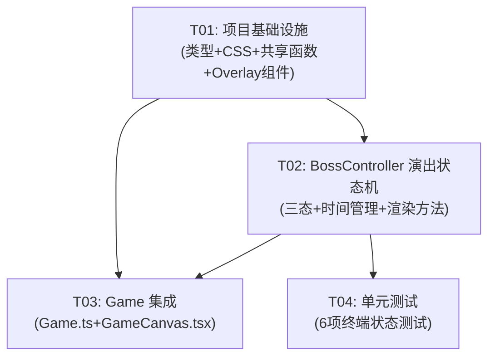

# 《我只要一刀》P4.4A.5 天雷劫与破境演出 — 系统设计 + 任务分解

> 版本: V0722006 | 基干: P4.4A.4 | 当前: 51/51 测试全绿
> 架构师: Bob | 日期: 2025-07

---

## Part A: 系统设计

### 1. 实施方式

#### 1.1 核心难点分析

| 难点 | 风险 | 对策 |
|------|------|------|
| 三段天雷的时间管理（精确到 0.15s 粒度的蓄能/劈落/闪白循环） | 🟡 中 | 在 BossController 中使用独立 tribulationTimer + tribulationStage 索引，所有渲染基于 stage 内相对时间计算 |
| 裂缝 → 雷光视觉过渡（drawExecutionCrack 产物的跨阶段传递） | 🟡 中 | tribulation_intro 阶段继续绘制 executionCrack，通过 lerp 颜色从白→紫→白渐变，tribulation 阶段停止绘制裂缝 |
| 环境压暗 + 雷云 + 天雷 + 光柱的叠加渲染 | 🟢 低 | 分层策略：CSS 做雷云/破境大字，Canvas 做环境压暗/天雷/光柱/粒子 |
| 三段递进中 Boss 残躯的震动/缩放/淡出协调 | 🟢 低 | 复用现有 execution_success 分裂态渲染，叠加 tribulationStage 参数控制缩放和透明度 |

#### 1.2 框架选型与架构模式

**无新增依赖**。所有效果使用现有技术栈：

| 效果 | 实现方式 | 原因 |
|------|----------|------|
| 环境压暗 | Canvas fillRect（BossController 内） | 与现有 vignette 实现一致 |
| 雷云 | CSS 叠加层（TribulationOverlay 组件） | 降低 Canvas 重绘开销，CSS 动画更流畅 |
| 裂缝转化 | Canvas drawExecutionCrack 扩展 | 复用现有代码，颜色过渡可控 |
| 天雷雷柱 | Canvas 绘制竖直渐变闪电 | 精细控制闪电形状，与闪白配合 |
| 屏幕闪白 | Canvas fillRect（Game.ts renderBossMode） | 复用现有 flash 机制 |
| 光柱 | Canvas 绘制渐变梯形 | 底部宽顶部窄，金色渐变 |
| 粒子流 | Canvas 粒子系统（BossController 内） | 复用现有粒子渲染循环 |
| 破境大字 | DOM 元素（TribulationOverlay 组件） | 大字样式更丰富，CSS animation 控制 |
| 灵气飘带 | Canvas 或 CSS 粒子 | 20-30 个粒子，轻量 |

**架构模式**：MVC 变异（Game 为 Controller，BossController 为 Model+部分 View，TribulationOverlay 为独立 View 层）

#### 1.3 关键架构决策

| 决策项 | 选择 | 理由 |
|--------|------|------|
| 天雷/光柱/雷云分工 | 雷云→CSS, 天雷/光柱→Canvas | CSS 雷云避免 Canvas 大量重绘，天雷需要精细 Canvas 控制 |
| 三段时间管理 | 独立 tribulationTimer + tribulationStage 索引 | 与现有 executionResultTimer 模式一致，无需引入新机制 |
| 裂缝转化 | drawExecutionCrack 在 tribulation_intro 继续绘制 | 复用现有代码，通过 color lerp 过渡 |
| Boss 残躯渲染 | 继续使用 execution_success 分裂态 + 震动/缩放/淡出 | 复用现有两半分裂渲染，叠加 tribulation 参数 |
| 共享函数导出位置 | `src/game/types.ts` | 已有类型定义，导出纯函数无循环依赖风险 |
| 破境大字 | DOM 元素（CSS） | 避免 Canvas 渲染大量文字，CSS animation 更简洁 |

---

### 2. 文件列表

#### 修改文件

| 文件路径 | 修改类型 | 说明 |
|----------|----------|------|
| `src/game/types.ts` | 修改 | 扩展 BossPhaseState，新增共享判断函数导出 |
| `src/game/systems/BossController.ts` | 修改 | 新增三态处理、时间管理、渲染方法 |
| `src/game/Game.ts` | 修改 | 修改 updateBossMode 调用链，渲染新阶段效果 |
| `src/game/GameCanvas.tsx` | 修改 | 集成 TribulationOverlay，更新 inExecution 判断 |
| `src/game/systems/BossController.test.ts` | 修改 | 新增 6 项终端状态测试 |

#### 新增文件

| 文件路径 | 说明 |
|----------|------|
| `src/styles/tribulation.css` | 雷云 + 环境压暗 + 破境大字 CSS 样式 |
| `src/components/TribulationOverlay.tsx` | 雷云/破境大字 React 叠加层组件 |

---

### 3. 数据结构和接口

```mermaid
classDiagram
    class BossPhaseState {
        <<type>>
        "loading" | "intro" | "armor" | "armor_break_show"
        | "armor_complete_hold" | "pursuit_intro" | "pursuit"
        | "core_break" | "execution_intro" | "execution"
        | "execution_success" | "execution_fail" | "victory_show"
        | "tribulation_intro" | "tribulation" | "breakthrough_show"
        | "result" | "fail" | "exit"
    }

    class BossController {
        - _phase: BossPhaseState
        - tribulationIntroTimer: number
        - tribulationTimer: number
        - tribulationStage: number  % 0, 1, 2
        - breakthroughShowTimer: number
        - tribulationDarkAlpha: number  % 环境压暗 0→0.5
        - lightningFlash: number  % 闪白 0→1
        - breakthroughLightColumn: number  % 光柱展开进度
        + get inputLocked(): boolean
        + get freezeCombatResources(): boolean
        + update(dt: number): void
        + renderWorld(ctx): void
        + renderOverlay(ctx): void
        - updateTribulationIntro(dt): void
        - updateTribulation(dt): void
        - updateBreakthroughShow(dt): void
        - drawTribulationDarkOverlay(ctx): void
        - drawLightningBolt(ctx, stage: number, stageT: number): void
        - drawBreakthroughColumn(ctx): void
        - drawBreakthroughParticles(ctx): void
        - drawBreakthroughRibbon(ctx): void
    }

    class TribulationOverlay {
        + props: { bossPhase: BossPhaseState; tribulationTimer: number; breakthroughShowTimer: number }
        - cloudAlpha: number  % 雷云透明度
        - bigTextAlpha: number  % 破境大字透明度
        + render(): ReactNode
        - renderClouds(): ReactNode
        - renderBreakthroughText(): ReactNode
    }

    class Game {
        - bossController: BossController
        - updateBossMode(scaledDt, frameDt): void
        - renderBossMode(ctx): void
        + get bossPhase(): BossPhaseState | null
    }

    class GameCanvas {
        - tribulationOverlayRef
        + props: { onBossPhaseChange }
        - renderTribulationOverlay(): ReactNode
    }

    BossController --> BossPhaseState : uses
    Game --> BossController : owns
    GameCanvas --> TribulationOverlay : renders
    GameCanvas --> Game : owns
    GameCanvas --> BossPhaseState : reads via onBossPhaseChange
    TribulationOverlay --> BossPhaseState : reads props
```

#### 共享判断函数（导出到 types.ts）

```typescript
// ---- P4.4A.5: 共享阶段判断函数 ----

/** 所有演出阶段（含新增天雷劫/破境） */
export function isBossCinematicPhase(phase: BossPhaseState): boolean {
  return ["victory_show", "tribulation_intro", "tribulation", "breakthrough_show"].includes(phase);
}

/** 所有输入锁定阶段 */
export function isBossInputLockedPhase(phase: BossPhaseState): boolean {
  return [
    "loading", "intro",
    "armor_break_show", "armor_complete_hold",
    "pursuit_intro", "core_break",
    "execution_intro", "execution_success", "execution_fail",
    "fail", "victory_show",
    "tribulation_intro", "tribulation", "breakthrough_show",
  ].includes(phase);
}

/** 终结流程阶段（含新增演出阶段，用于 freezeCombatResources） */
export function isExecutionFlowPhase(phase: BossPhaseState): boolean {
  return [
    "execution_intro", "execution", "execution_success", "execution_fail",
    "fail", "victory_show",
    "tribulation_intro", "tribulation", "breakthrough_show",
  ].includes(phase);
}
```

#### tribulation 阶段内部状态

```typescript
// tribulation 阶段内部时间参数（由 BossController 管理）
const TRIBULATION_STAGE_DURATION = 0.6;    // 每段 0.6s
const TRIBULATION_CHARGE_DURATION = 0.15;  // 蓄能 0.15s
const TRIBULATION_STRIKE_DURATION = 0.45;  // 劈落 0.45s
const TRIBULATION_TOTAL_STAGES = 3;

// breakthrough_show 阶段时间参数
const BREAKTHROUGH_COLUMN_RISE = 0.5;      // 光柱展开 0.5s
const BREAKTHROUGH_TEXT_SHOW = 1.5;        // 大字显示 1.5s
const BREAKTHROUGH_TEXT_FADE = 0.5;        // 大字淡出 0.5s
const BREAKTHROUGH_TOTAL = 2.0;            // 总时长 2.0s
```

---

### 4. 程序调用流程

```mermaid
sequenceDiagram
    participant Game as Game.updateBossMode()
    participant BC as BossController
    participant Render as Game.renderBossMode()
    participant Overlay as TribulationOverlay

    Note over Game,Overlay: === 现有流程 ===
    Game->>BC: update(dt)
    BC->>BC: executionResultTimer >= 2.0
    BC->>BC: _phase = "victory_show"
    Game->>BC: check phase
    Note over Game: 旧: phase === "victory_show" → finish(true)

    Note over Game,Overlay: === P4.4A.5 新流程 ===
    Game->>BC: update(dt)
    BC->>BC: executionResultTimer >= 2.0
    BC->>BC: _phase = "victory_show"
    BC->>BC: victory_show 粒子持续淡出 (P1-2)
    BC->>BC: victoryShowTimer >= 0.5 (可配置)
    BC->>BC: _phase = "tribulation_intro"
    BC->>BC: tribulationIntroTimer = 0

    rect rgb(20, 10, 40)
        Note over BC: tribulation_intro 阶段
        loop 每帧
            Game->>BC: update(dt)
            BC->>BC: tribulationIntroTimer += dt
            BC->>BC: 环境压暗 0→0.5 (0-0.5s)
            Overlay->>Overlay: 雷云CSS渐入 (0-1.5s)
            BC->>BC: 裂缝颜色白→紫→白过渡
            alt tribulationIntroTimer >= 1.5
                BC->>BC: _phase = "tribulation"
                BC->>BC: tribulationTimer = 0
                BC->>BC: tribulationStage = 0
            end
        end
    end

    rect rgb(40, 10, 30)
        Note over BC: tribulation 阶段
        loop 每帧
            Game->>BC: update(dt)
            BC->>BC: tribulationTimer += dt
            BC->>BC: tribulationStage = floor(tribulationTimer / 0.6)
            BC->>BC: stageT = tribulationTimer % 0.6

            alt stageT < 0.15
                Note over BC: 蓄能：白光闪烁
                BC->>BC: lightningFlash = stageT / 0.15
            else
                Note over BC: 劈落：雷柱 + 闪白 + Boss效果
                BC->>BC: 绘制竖直雷柱 (白→紫渐变)
                BC->>BC: screenShake 震动
                BC->>BC: flash = 0.1 (屏幕闪白)
            end

            alt tribulationStage == 0
                Note over BC: Boss 震动裂痕
            else tribulationStage == 1
                Note over BC: Boss 缩小至 60%
                BC->>BC: bossRenderScale = 0.6
            else tribulationStage == 2
                Note over BC: Boss 完全消失
                BC->>BC: bossRenderScale → 0, alpha → 0
            end

            alt tribulationTimer >= 1.8
                BC->>BC: _phase = "breakthrough_show"
                BC->>BC: breakthroughShowTimer = 0
            end
        end
    end

    rect rgb(10, 30, 20)
        Note over BC: breakthrough_show 阶段
        loop 每帧
            Game->>BC: update(dt)
            BC->>BC: breakthroughShowTimer += dt

            alt breakthroughShowTimer < 0.5
                Note over BC: 光柱展开
                BC->>BC: drawBreakthroughColumn(progress)
            else
                Note over BC: 光柱稳定
                BC->>BC: 持续绘制光柱
                BC->>BC: 绘制上升粒子流 (20-30个)
                BC->>BC: 绘制边缘飘带
            end

            alt breakthroughShowTimer >= 1.5
                Overlay->>Overlay: 破境大字显示
            end
            alt breakthroughShowTimer >= 2.0
                Note over BC: 阶段结束
                BC->>BC: _phase = "result"
            end
        end
    end

    Game->>BC: check phase === "result"
    Game->>Game: finish(true)
    Game->>Game: onFinish(result)
    Note over Game: App.tsx 收到 result → 进入破境结果页
```



---

### 5. 待明确事项

| 事项 | 假设/决策 |
|------|-----------|
| victory_show 到 tribulation_intro 过渡等待时间 | 假设 0.5s（victory_show 粒子淡出 + 文字保持），可调 |
| 天雷三段内每段的时间分配 | 严格按 PRD 时间线：每段 0.6s（蓄能 0.15s + 劈落 0.45s） |
| 裂缝转化颜色方案 | 白→紫→白渐变，由 drawExecutionCrack 扩展实现 |
| 破境大字颜色 | 金色 #f0e130，阴影金色发光，大号 36px |
| 灵气飘带数量 | 20-30 个粒子，金色/白色交替 |
| 三段天雷后 shards 清理 | 第三段结束后执行 shards 数组清空 |
| 演出总时长 | ~5.3s（tribulation_intro 1.5s + tribulation 1.8s + breakthrough_show 2.0s） |
| 演出期间是否可跳过 | 首版不提供跳过功能 |

---

## Part B: 任务分解

### 6. 依赖包列表

**无新增依赖。** 使用现有技术栈：
- vite@5.x (构建工具)
- react@18.x (UI 框架)
- vitest@1.x (测试框架)
- 全部 Canvas 原生渲染，无需第三方图形库

---

### 7. 任务列表（按依赖顺序排列）

#### T01: 项目基础设施（类型扩展 + CSS 样式 + 共享判断函数 + TribulationOverlay 组件）

| 字段 | 内容 |
|------|------|
| **Task ID** | T01 |
| **Task Name** | 项目基础设施：类型扩展、CSS 样式、共享判断函数导出、TribulationOverlay 组件 |
| **Priority** | P0 |
| **Dependencies** | 无 |

**涉及文件：**
- `src/game/types.ts` — 修改
  - BossPhaseState 扩展三新状态：`"tribulation_intro"` | `"tribulation"` | `"breakthrough_show"`
  - 导出三个纯函数：`isBossCinematicPhase()`、`isBossInputLockedPhase()`、`isExecutionFlowPhase()`
- `src/styles/tribulation.css` — 新增
  - `.tribulation-clouds`：雷云 CSS 样式（多层暗紫色云，从顶部渐入，opacity 动画）
  - `.tribulation-dark-overlay`：环境压暗 CSS 备用层（主压暗由 Canvas 负责）
  - `.breakthrough-text`：破境大字样式（金色 #f0e130，大号，shadow-glow）
  - `.breakthrough-text--fade`：淡出动画
  - CSS keyframes 动画定义
- `src/components/TribulationOverlay.tsx` — 新增
  - Props: `{ bossPhase: BossPhaseState; tribulationIntroTimer: number; breakthroughShowTimer: number }`
  - 渲染雷云层（CSS 多层暗紫色云，top→bottom 渐入）
  - 渲染破境大字（"突破成功"，金色，大号，1.5s 显示 + 0.5s 淡出）
  - 所有透明度/动画通过 CSS class 切换 + 内联 style 控制

**验收标准：**
- [ ] BossPhaseState 类型包含三个新状态
- [ ] `isBossCinematicPhase` 覆盖 victory_show, tribulation_intro, tribulation, breakthrough_show
- [ ] `isBossInputLockedPhase` 覆盖所有演出阶段
- [ ] `isExecutionFlowPhase` 包含新增演出阶段
- [ ] TribulationOverlay 在 tribulation_intro 阶段显示雷云
- [ ] TribulationOverlay 在 breakthrough_show 阶段显示破境大字
- [ ] CSS 动画平滑不卡顿

---

#### T02: BossController 演出状态机（新增三态 + 时间管理 + 渲染方法）

| 字段 | 内容 |
|------|------|
| **Task ID** | T02 |
| **Task Name** | BossController 演出状态机：新增三态处理、时间管理、渲染方法 |
| **Priority** | P0 |
| **Dependencies** | T01 |

**涉及文件：**
- `src/game/systems/BossController.ts` — 修改

**具体修改内容：**

**a) 新增属性：**
```typescript
private tribulationIntroTimer = 0;
private tribulationTimer = 0;
private tribulationStage = 0;       // 0, 1, 2
private breakthroughShowTimer = 0;
private tribulationDarkAlpha = 0;    // 环境压暗 0→0.5
private breakthroughParticles: { x: number; y: number; vx: number; vy: number; life: number; maxLife: number; size: number; color: string }[] = [];
private breakthroughRibbons: { x: number; y: number; vx: number; vy: number; life: number; maxLife: number; alpha: number }[] = [];
```

**b) 时间常量：**
```typescript
private readonly TRIBULATION_INTRO_DURATION = 1.5;
private readonly TRIBULATION_STAGE_DURATION = 0.6;
private readonly TRIBULATION_TOTAL_STAGES = 3;
private readonly BREAKTHROUGH_SHOW_DURATION = 2.0;
private readonly VICTORY_SHOW_TO_TRIBULATION = 0.5; // victory_show 保持时间
```

**c) update() 扩展：**
- `victory_show` → `tribulation_intro` 过渡（victoryShowTimer >= VICTORY_SHOW_TO_TRIBULATION）
- `tribulation_intro` → `tribulation` 过渡（tribulationIntroTimer >= 1.5）
- `tribulation` → `breakthrough_show` 过渡（tribulationTimer >= 1.8）
- `breakthrough_show` → `result` 过渡（breakthroughShowTimer >= 2.0）

**d) 新增 update 方法：**
- `updateTribulationIntro(dt)`：更新环境压暗 alpha、裂缝颜色过渡
- `updateTribulation(dt)`：更新 tribulationTimer、stage 计算、Boss 残骸缩放/透明度
- `updateBreakthroughShow(dt)`：更新 breakthroughShowTimer、粒子流

**e) 新增渲染方法：**
- `drawTribulationDarkOverlay(ctx)`：Canvas 全屏暗色半透明叠加层
- `drawLightningBolt(ctx, stage, stageT)`：绘制竖直雷柱（白→紫渐变）
- `drawBreakthroughColumn(ctx)`：绘制金色光柱（底部宽顶部窄梯形）
- `drawBreakthroughParticles(ctx)`：绘制上升金色粒子流（20-30 个）
- `drawBreakthroughRibbons(ctx)`：绘制屏幕边缘飘带

**f) 修改现有方法：**
- `inputLocked` getter：新增 tribulation_intro/tribulation/breakthrough_show 为锁定
- `freezeCombatResources` getter：同上
- `isExecutionLockedPhase()`：包含新三态
- `isExecutionFlowPhase()`：包含新三态
- `drawBoss()`：在 tribulation 阶段继续绘制分裂态，叠加震动 + 缩放 + 淡出
- `drawExecutionCrack()`：在 tribulation_intro 阶段颜色过渡（白→紫→白）
- `renderWorld()`：包含新阶段的渲染方法
- `renderOverlay()`：包含新阶段的 overlay 渲染
- `enterLoading()`：重置所有新属性

**g) victory_show 粒子淡出 (P1-2)：**
- `drawBoss()` 中 victory_show 阶段：粒子 baseline 保持，executionParticles 自然淡出
- 进入 tribulation_intro 时 executionParticles 已清空

**h) 输入锁定与资源冻结 (P1-3)：**
- 将 tribulation_intro/tribulation/breakthrough_show 加入 inputLocked 列表
- 将三态加入 freezeCombatResources 列表

**验收标准：**
- [ ] tribulation_intro 阶段环境压暗从 0→0.5 渐入
- [ ] 三段天雷逐次劈落，间隔 ~0.6s
- [ ] 每段天雷包含蓄能闪烁 + 雷柱 + 闪白
- [ ] 第一段 Boss 震动，第二段缩小至 60%，第三段完全消失
- [ ] breakthrough_show 阶段光柱展开 + 粒子流 + 飘带
- [ ] 三阶段完成后进入 result 状态
- [ ] 三阶段期间 inputLocked=true, freezeCombatResources=true
- [ ] victory_show 粒子淡出自然

---

#### T03: Game 集成（Game.ts + GameCanvas.tsx 修改）

| 字段 | 内容 |
|------|------|
| **Task ID** | T03 |
| **Task Name** | Game 集成：修改 Game.ts 调用链 + GameCanvas.tsx 集成 TribulationOverlay |
| **Priority** | P0 |
| **Dependencies** | T01, T02 |

**涉及文件：**
- `src/game/Game.ts` — 修改
- `src/game/GameCanvas.tsx` — 修改

**Game.ts 具体修改：**

**a) `updateBossMode()` 修改：**
```typescript
// 旧代码：
if (this.bossController?.phase === "victory_show") {
  this.finish(true);
  return;
}

// 新代码：
if (this.bossController?.phase === "result") {
  this.finish(true);
  return;
}
```

**b) `renderBossMode()` 修改：**
- 在 tribulation_intro 阶段：绘制环境压暗叠加层
- 在 tribulation 阶段：绘制屏幕闪白（复用现有 flash 机制）+ 雷柱
- 在 breakthrough_show 阶段：绘制光柱 + 粒子 + 飘带
- 更新 `inExecution` 判断数组，包含新三态（保持隐藏普通斩/破按钮）

**c) 导入更新：**
- 导入 `isBossCinematicPhase`、`isExecutionFlowPhase` 等共享函数（从 types.ts）

**GameCanvas.tsx 具体修改：**

**a) 集成 TribulationOverlay：**
- 在 canvas 元素上方渲染 `<TribulationOverlay>` 组件
- 通过 `onBossPhaseChange` 回调传递 bossPhase 给 overlay
- 同步传递 tribulationIntroTimer / breakthroughShowTimer

**b) 更新 `inExecution` 判断：**
```typescript
// 旧 (in Game.ts renderBossMode):
const inExecution = phase && ["execution_intro", "execution", "execution_success", "execution_fail", "fail", "victory_show"].includes(phase);

// 新:
const inExecution = phase && ["execution_intro", "execution", "execution_success", "execution_fail", "fail", "victory_show", "tribulation_intro", "tribulation", "breakthrough_show"].includes(phase);
```

**验收标准：**
- [ ] victory_show 不再直接触发 finish(true)
- [ ] result 状态正确触发 finish(true)
- [ ] 演出阶段隐藏普通 UI 元素（暂停按钮、刀势等）
- [ ] TribulationOverlay 在正确阶段渲染
- [ ] 演出阶段 inputLocked 生效（handlePointerDown/Move/Up 均被阻止）

---

#### T04: 单元测试（6 项新增 terminal 状态测试）

| 字段 | 内容 |
|------|------|
| **Task ID** | T04 |
| **Task Name** | 终端状态单元测试：新增 6 项 tribulation/breakthrough 测试 |
| **Priority** | P0 |
| **Dependencies** | T02 |

**涉及文件：**
- `src/game/systems/BossController.test.ts` — 修改

**新增测试用例（6 项）：**

**测试 1: tribulation_intro 期间 inputLocked=true**
```typescript
it("tribulation_intro 期间 inputLocked=true", () => {
  const bc = createBoss();
  toVictoryShow(bc);
  bc.update(0.5); // → tribulation_intro
  expect(bc.phase).toBe("tribulation_intro");
  expect(bc.inputLocked).toBe(true);
});
```

**测试 2: tribulation 期间 freezeCombatResources=true**
```typescript
it("tribulation 期间 freezeCombatResources=true", () => {
  const bc = createBoss();
  toVictoryShow(bc);
  bc.update(0.5); // → tribulation_intro
  bc.update(1.5); // → tribulation
  expect(bc.phase).toBe("tribulation");
  expect(bc.freezeCombatResources).toBe(true);
});
```

**测试 3: tribulation_intro 阶段 bossVisualState 正确**
```typescript
it("tribulation_intro 阶段 bossVisualState 为湮灭中", () => {
  const bc = createBoss();
  toVictoryShow(bc);
  bc.update(0.5); // tribulation_intro
  // 验证 execution_success 分裂态仍在渲染（残躯未完全消失）
  expect(bc.phase).toBe("tribulation_intro");
  // 分裂态应该在渲染中
});
```

**测试 4: breakthrough_show 阶段 bossVisualState 正确**
```typescript
it("breakthrough_show 阶段 bossVisualState 为已湮灭", () => {
  const bc = createBoss();
  toVictoryShow(bc);
  bc.update(0.5); // tribulation_intro
  bc.update(1.5); // tribulation
  bc.update(1.8); // breakthrough_show
  expect(bc.phase).toBe("breakthrough_show");
  // Boss 残躯应完全消失
});
```

**测试 5: 三段天雷后 shards 清理完毕**
```typescript
it("三段天雷后 shards 清理完毕", () => {
  const bc = createBoss();
  toVictoryShow(bc);
  bc.update(0.5); // tribulation_intro
  bc.update(1.5); // tribulation (三段完整执行)
  // 第三段结束后 shards 应被清理
  expect(bc["executionShards"]?.length ?? 0).toBe(0);
});
```

**测试 6: victory_show → tribulation_intro 正确过渡**
```typescript
it("victory_show 结束后进入 tribulation_intro 而非直接 finish", () => {
  const bc = createBoss();
  toVictoryShow(bc);
  expect(bc.phase).toBe("victory_show");
  bc.update(0.5);
  expect(bc.phase).toBe("tribulation_intro");
  // 不应直接到 result
  expect(bc.phase).not.toBe("result");
});
```

**辅助函数：** `toVictoryShow(bc)` 推进到 victory_show 阶段

**验收标准：**
- [ ] 6 项新增测试全部通过
- [ ] 原有 51 项测试保持绿色
- [ ] 测试覆盖三个新状态的锁/冻结/视觉状态

---

### 8. 共享知识（跨文件约定）

#### 8.1 BossPhaseState 类型扩展

```typescript
// 新增三个状态（按顺序插入 victory_show 与 result 之间）
export type BossPhaseState = 
  | "loading" | "intro" | "armor" 
  | "armor_break_show" | "armor_complete_hold" 
  | "pursuit_intro" | "pursuit" | "core_break"
  | "execution_intro" | "execution" 
  | "execution_success" | "execution_fail" 
  | "victory_show"
  | "tribulation_intro"   // 新增：环境压暗/雷云聚集/裂缝转化
  | "tribulation"          // 新增：三段天雷
  | "breakthrough_show"    // 新增：破境光柱/粒子流/大字
  | "result" | "fail" | "exit";
```

#### 8.2 演出阶段 bossVisualState 定义

| 阶段 | Boss 残躯视觉状态 | 裂缝状态 | 粒子状态 |
|------|-------------------|----------|----------|
| victory_show | 分裂态（两半），alpha 淡出中 | 窄裂缝，白线 | executionParticles 淡出 |
| tribulation_intro | 分裂态，alpha 继续淡出 | 裂缝颜色白→紫→白过渡 | executionParticles 已清空 |
| tribulation (stage 0) | 分裂态，震动 | 不绘制裂缝 | 雷击粒子 |
| tribulation (stage 1) | 分裂态，缩小至 60% | 不绘制裂缝 | 雷击粒子 |
| tribulation (stage 2) | 完全消失 | 不绘制裂缝 | 雷击粒子 |
| breakthrough_show | 无 | 无 | 金色粒子流 |

#### 8.3 API 响应格式约定

- 所有时间单位为秒（float）
- 所有 Canvas 坐标使用 DESIGN_WIDTH (390) × DESIGN_HEIGHT (844) 归一化空间
- BossController 的 `_phase` 属性通过 `as BossPhaseState` 类型断言赋值（复用现有模式）
- TribulationOverlay 通过 props 接收 bossPhase 和 timer 值，不直接访问 BossController
- 演出阶段定义在 `types.ts` 中的共享函数集中管理，BossController 和 Game 均引用该函数

#### 8.4 时间线常量约定

```typescript
// 全局时间常量（BossController 内定义）
const TRIBULATION_INTRO_DURATION = 1.5;    // 环境压暗 + 雷云 + 裂缝转化
const TRIBULATION_STAGE_DURATION = 0.6;    // 每段天雷时长
const TRIBULATION_TOTAL_STAGES = 3;        // 三段天雷
const TRIBULATION_TOTAL = 1.8;             // 天雷总时长 (3 * 0.6)
const BREAKTHROUGH_SHOW_DURATION = 2.0;    // 破境光柱 + 大字
const VICTORY_SHOW_HOLD = 0.5;             // victory_show 保持时间
```

---

### 9. 任务依赖图



**依赖说明：**
- T01 无依赖，最先开始（类型扩展是所有后续代码的基础）
- T02 依赖 T01（需要新的 BossPhaseState 类型）
- T03 依赖 T01 + T02（需要 TribulationOverlay 组件 + BossController 新状态）
- T04 依赖 T02（需要新的状态机逻辑才能编写测试）