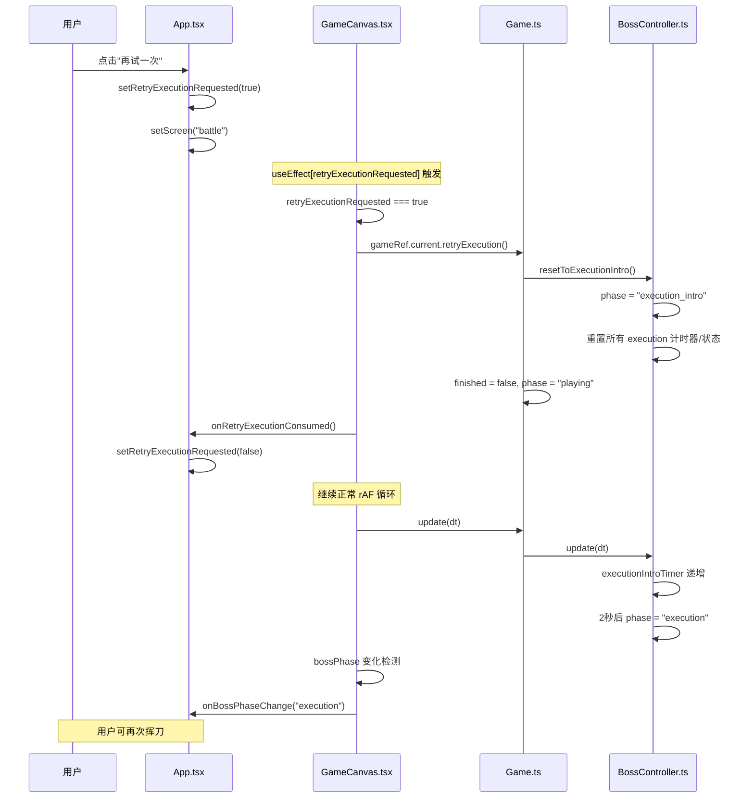
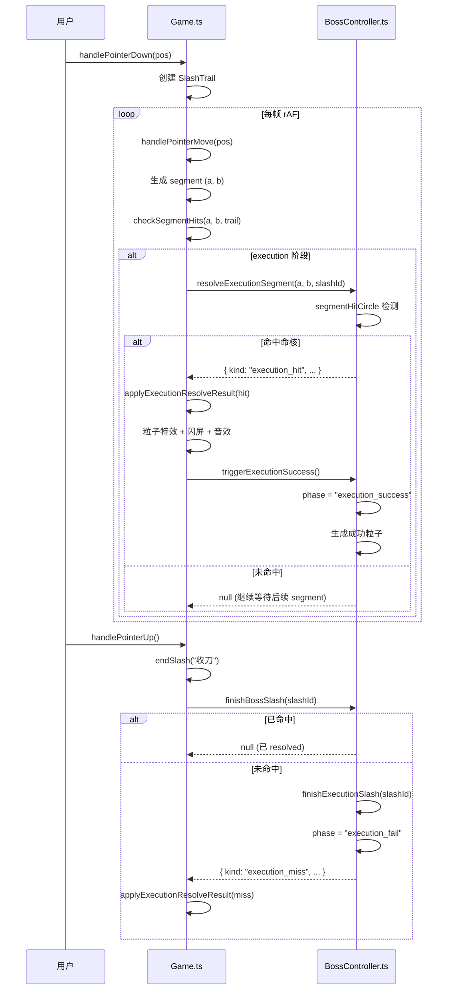
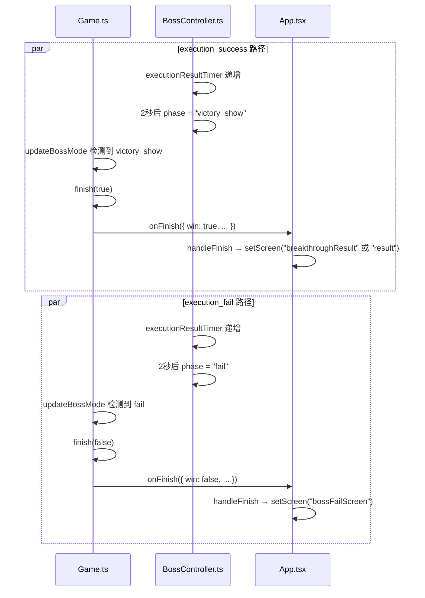
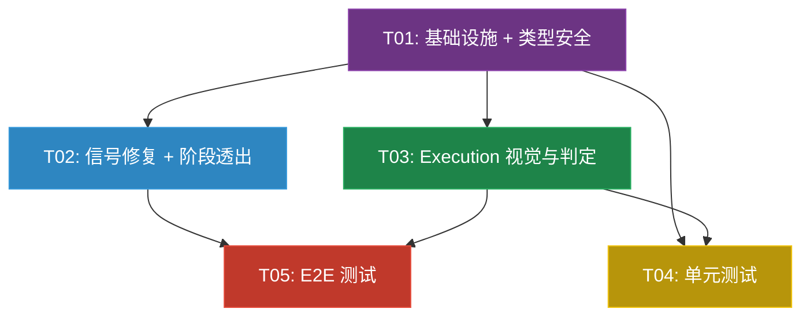

# 《我只要一刀》系统设计文档 — Boss 终结阶段封板修复

> 版本: V0722002 | 基干: P4.4A.4 Boss 终结阶段首版 | 日期: 2025-07-22

---

## Part A: 系统设计

### 1. 实现方案

#### 1.1 核心难点分析

| 难点 | 分析 | 方案 |
|------|------|------|
| **P0-1: 信号跨局污染** | retryExecutionSignal 使用 `useState(0)` 递增计数，GameCanvas 重新挂载时 useEffect 消费旧 signal 值（因 React 18 严格模式 double-mount 或 unmount→remount 时 signal 值未重置） | 改为 `boolean` + `onRetryExecutionConsumed` 回调归零，确保一次性事件语义 |
| **P1-1: Boss 阶段透出** | BossController 的 phase 字段在 Canvas 层的 Game 实例中，React UI 层（App.tsx）无法直接读取，导致无法根据阶段隐藏按钮 | 最低成本方案：GameCanvas 通过 `onBossPhaseChange` 回调在 rAF 循环中同步 phase 变化到 App |
| **P1-4: 画面矛盾** | 成功时 Boss 绘制完整 silhouette 与"一刀两断"文字矛盾，Boss 应沿裂缝分裂成两片各向左右偏移淡出 | 在 execution_success 阶段修改 drawBoss 逻辑，根据 executionResultTimer 计算左右分裂偏移 + alpha 淡出 |
| **P2-1: as any 类型安全** | Game.ts 中多处通过 `(this.bossController as any).xxx()` 调用 BossController 方法，丧失了 TypeScript 类型检查 | 方法实际已为 public，只需移除 `as any` 强制转换，并将 `ExecutionResolveResult` 通过正常 import 引用 |

#### 1.2 技术栈

**维持现有技术栈不变：**
- Vite 6 + React 19 + TypeScript 5.7
- Vitest（单元测试）
- Playwright（E2E 测试）
- 无新增第三方依赖

#### 1.3 架构模式

- **MVC 变体**：App.tsx（View/Controller）、Game.ts（Controller/Model）、BossController.ts（Model）
- **信号/回调模式**：React state → props → GameCanvas useEffect → Game method 调用链，通过回调返回结果/归零信号
- **状态机模式**：BossController 内部状态机（loading→intro→armor→...→execution→...→victory_show/fail）
- **E2E 桥模式**：`__E2E_BRIDGE__` 编译期标志控制的内联代码块，生产构建 DCE 零残留

---

### 2. 文件列表

| 文件路径 | 操作 | 说明 |
|----------|------|------|
| `.gitignore` | 修改 | 添加 `dist_prod_check*/` 规则 |
| `src/App.tsx` | 修改 | P0-1: retryExecutionSignal 改为 boolean + consume 回调；P1-1: 监听 bossPhase 控制按钮显隐 |
| `src/game/GameCanvas.tsx` | 修改 | P0-1: 新增 onRetryExecutionConsumed 回调 + useEffect 清理；P1-1: 新增 onBossPhaseChange 回调 |
| `src/game/Game.ts` | 修改 | P0-1: retryExecution 方法调整；P1-1: 暴露 bossPhase 读取；P1-5: E2E 桥新增 executionTarget；P2-1: 移除 as any 类型转换 |
| `src/game/types.ts` | 修改 | P2-1: 新增 ExecutionResolveResult 类型导出（或从 BossController 重导出） |
| `src/game/systems/BossController.ts` | 修改 | P1-2: 命核椭圆判定；P1-3: 文字动画时长修复；P1-4: Boss 分裂渲染；P2-1: 正式接口声明 |
| `src/game/systems/BossController.test.ts` | 修改 | P0-2: 新增 12+ execution 阶段单元测试 |
| `e2e/boss-execution.spec.ts` | 新增 | P1-5: execution 路径 E2E 测试（成功+失败重试） |

---

### 3. 数据结构和接口

#### 3.1 类图

```mermaid
classDiagram
    class App {
        +retryExecutionRequested: boolean
        +bossPhase: BossPhaseState
        +handleRetryExecution() void
        +onRetryExecutionConsumed() void
        +onBossPhaseChange(phase: BossPhaseState) void
        +render() JSX
    }
    
    class GameCanvas {
        +level: LevelConfig
        +onFinish: (result: BattleResult) => void
        +onReviveOffer?: (offer: ReviveOffer) => void
        +reviveSignal?: number
        +declineReviveSignal?: number
        +paused?: boolean
        +runMode?: "normal" | "challenge"
        +retryExecutionRequested?: boolean
        +onRetryExecutionConsumed?: () => void
        +onBossPhaseChange?: (phase: BossPhaseState) => void
        -gameRef: MutableRefObject<Game | null>
        -lastBossPhase: BossPhaseState
        +useEffect[retryExecutionRequested]() void
        +useEffect[rAF loop]() void
    }
    
    class Game {
        +bossController: BossController | null
        +retryExecution() void
        +get bossPhase(): BossPhaseState
        -checkSegmentHits(a: Vec2, b: Vec2, trail: SlashTrail) void
        -applyExecutionResolveResult(result: ExecutionResolveResult, ...) void
        -finalizeBossSlashCommon(trail: SlashTrail) void
        -renderBossMode(ctx: CanvasRenderingContext2D) void
        -updateBossMode(dt: number) void
    }
    
    class BossController {
        -_phase: BossPhaseState
        +get phase(): BossPhaseState
        +get inputLocked(): boolean
        +get freezeCombatResources(): boolean
        +resolveExecutionSegment(segA: Vec2, segB: Vec2, slashId: string): ExecutionResolveResult | null
        +finishExecutionSlash(slashId: string): ExecutionResolveResult | null
        +triggerExecutionSuccess(): void
        +resetToExecutionIntro(): void
        +getExecutionCoreWorldPos(): { cx: number; cy: number; radius: number }
        +finishBossSlash(slashId: string): ... | null
        +update(dt: number): void
        -drawBoss(ctx: any): void
        -drawExecutionSuccess(ctx: any): void
        -drawExecutionFail(ctx: any): void
        -EXECUTION_CORE_RADIUS: number  ~ 改为椭圆
        -executionResultTimer: number
        -executionParticles: array
    }
    
    class ExecutionResolveResult {
        <<union>>
        +kind: "execution_hit" | "execution_miss"
        +hitPos?: Vec2
        +coreCenter?: Vec2
        +slashId: string
    }
    
    class BossPhaseState {
        <<enum>>
        "loading" | "intro" | "armor" | "armor_break_show" | "armor_complete_hold" | 
        "pursuit_intro" | "pursuit" | "core_break" | "execution_intro" | 
        "execution" | "execution_success" | "execution_fail" | 
        "victory_show" | "result" | "fail" | "exit"
    }
    
    App --> GameCanvas : props
    GameCanvas --> Game : creates & manages
    Game --> BossController : creates & routes
    BossController --> ExecutionResolveResult : returns
    BossController --> BossPhaseState : uses
```

#### 3.2 关键接口定义

**ExecutionResolveResult**（已有，需从 BossController.ts 正式导出到 types.ts）：

```typescript
// src/game/types.ts 新增
export type ExecutionResolveResult =
  | { kind: "execution_hit"; hitPos: Vec2; coreCenter: Vec2; slashId: string }
  | { kind: "execution_miss"; slashId: string };
```

**BossController 正式接口**（P2-1 移除 as any 后可直接调用）：

```typescript
// 以下方法均为 public，Game.ts 可直接通过 this.bossController.xxx() 调用
public resolveExecutionSegment(segA: Vec2, segB: Vec2, slashId: string): ExecutionResolveResult | null
public finishExecutionSlash(slashId: string): ExecutionResolveResult | null
public triggerExecutionSuccess(): void
public resetToExecutionIntro(): void
```

**GameCanvas 新增 Props**（P0-1 + P1-1）：

```typescript
type GameCanvasProps = {
  // ... 已有 props
  retryExecutionRequested?: boolean;           // 替代 retryExecutionSignal
  onRetryExecutionConsumed?: () => void;       // 新增：消费后回调归零
  onBossPhaseChange?: (phase: BossPhaseState) => void; // 新增：Boss阶段变化回调
};
```

---

### 4. 程序调用流程

#### 4.1 失败重试完整流程（P0-1 核心路径）



#### 4.2 Execution 命中判定流程



#### 4.3 Execution 终端状态 → 结算流程



---

### 5. 待明确事项

1. **P0-1 信号归零时机**：`onRetryExecutionConsumed` 是在 `Game.retryExecution()` 调用完成后立即回调，还是在 GameCanvas 的 useEffect 执行完毕后？—— 设定为：GameCanvas 的 useEffect 中，调用 `gameRef.current.retryExecution()` 后立即调用 `onRetryExecutionConsumed()`。

2. **P1-1 按钮隐藏范围**：具体哪些按钮需要隐藏？仅暂停按钮（`❚❚`），还是包括暂停弹窗中的"重新挑战"/"退出"？—— 假设仅隐藏战斗中的暂停按钮，暂停弹窗本身不受影响（因为 execution 阶段 inputLocked 已由 BossController 控制）。

3. **P1-2 命核椭圆与视觉统一**：`EXECUTION_CORE_RADIUS` 当前是圆形常量（radius:55），改为椭圆后 `getExecutionCoreWorldPos()` 返回类型需从 `{cx,cy,radius}` 改为 `{cx,cy,rx,ry}`，是否影响 Game.ts 中引用该方法的其他地方？—— 需要在 Game.ts 的 `applyExecutionResolveResult` 中检查 `segmentHitCircle` 调用是否受影响。

4. **P1-4 Boss 分裂**：Boss 沿裂缝分成两半的视觉实现——左右两片各自偏移的距离和淡出速度未在 PRD 中明确。假设：左片 x -= 30~60，右片 x += 30~60，alpha 在 1.8s 内从 1→0。

5. **P1-5 E2E 重试路径**：失败重试路径中，需要从 bossFailScreen 点击"再试一次"触发重试，但 E2E 测试中如何导航到 bossFailScreen？—— 通过程序化触发 execution_miss（挥空），等待 phase 变为 fail，然后页面应自动切换到 bossFailScreen。

---

## Part B: 任务分解

### 6. 依赖包列表

**无新增依赖包。** 当前项目已有：
- `react@^19.0.0`、`react-dom@^19.0.0`
- `vite@^6.0.7`、`@vitejs/plugin-react@^4.3.4`
- `typescript@^5.7.2`
- `vitest@^4.1.10`（dev）
- `@playwright/test@^1.61.1`（dev）
- `@testing-library/react@^16.3.2`（dev）

---

### 7. 任务列表

#### T01: 项目基础设施 + 类型安全改造

| 属性 | 值 |
|------|-----|
| **Task ID** | T01 |
| **优先级** | P0 |
| **依赖** | 无 |
| **源文件** | `.gitignore`, `src/game/types.ts`, `src/game/systems/BossController.ts`, `src/game/Game.ts` |

**改动内容：**

1. **`.gitignore`**：在末尾添加 `dist_prod_check*/` 规则（P2-2）
2. **`src/game/types.ts`**：新增 `ExecutionResolveResult` 类型（从 BossController.ts 迁移/重导出）
3. **`src/game/systems/BossController.ts`**：
   - 导入 `ExecutionResolveResult` 从 types.ts（而非本地定义）
   - 确认 `resolveExecutionSegment`、`triggerExecutionSuccess`、`resetToExecutionIntro` 为 public 方法
   - 导出 `ExecutionResolveResult` 类型（若保留本地定义则加 export）
4. **`src/game/Game.ts`**：
   - 移除 `bossController` 字段声明中的 `import("./systems/BossController").BossController` 内联类型，改为顶部 `import { BossController, ExecutionResolveResult } from "./systems/BossController"`
   - 移除所有 `(this.bossController as any).xxx()` 强制转换，改为直接调用 `this.bossController.xxx()`
   - 将 `applyExecutionResolveResult` 参数类型从内联 `import("./systems/BossController").ExecutionResolveResult` 改为顶部导入的类型

#### T02: 失败重试信号修复 + Boss 阶段透出

| 属性 | 值 |
|------|-----|
| **Task ID** | T02 |
| **优先级** | P0 |
| **依赖** | T01 |
| **源文件** | `src/App.tsx`, `src/game/GameCanvas.tsx`, `src/game/Game.ts` |

**改动内容：**

1. **`src/App.tsx`**（P0-1 + P1-1）：
   - 将 `retryExecutionSignal` 从 `useState(0)` 改为 `useState(false)`（命名为 `retryExecutionRequested`）
   - 新增 `onRetryExecutionConsumed` 回调：`() => setRetryExecutionRequested(false)`
   - 将 `retryExecutionSignal={retryExecutionSignal}` 改为 `retryExecutionRequested={retryExecutionRequested}` + `onRetryExecutionConsumed={onRetryExecutionConsumed}`
   - 所有入口点检查 `setRetryExecutionRequested(false)`：bossFailScreen "再试一次"按钮设置为 `true`；"重新挑战"和"返回"不涉及信号；`restartBattle` 创建新 Game 实例无需信号
   - 新增 `bossPhase` 状态 (`useState<BossPhaseState | null>(null)`)
   - 新增 `handleBossPhaseChange` 回调：`(phase) => setBossPhase(phase)`
   - 传递 `onBossPhaseChange={handleBossPhaseChange}` 给 GameCanvas
   - 在 `screen === "battle"` 渲染块中，根据 `bossPhase` 判断是否在 execution 阶段，条件渲染暂停按钮（execution_intro/execution/execution_success/execution_fail 时隐藏）

2. **`src/game/GameCanvas.tsx`**（P0-1 + P1-1）：
   - Props 类型：`retryExecutionSignal?: number` → `retryExecutionRequested?: boolean`
   - 新增 Props：`onRetryExecutionConsumed?: () => void`
   - 新增 Props：`onBossPhaseChange?: (phase: BossPhaseState) => void`
   - 修改 `useEffect` 依赖 `retryExecutionSignal` 的块：
     - 改为依赖 `retryExecutionRequested`
     - 条件 `if (retryExecutionSignal > 0)` → `if (retryExecutionRequested)`
     - 调用 `gameRef.current?.retryExecution()` 后立即调用 `onRetryExecutionConsumed?.()`
   - 在 rAF 循环的 tick 函数中，每帧检查 `gameRef.current?.bossController?.phase`，若与 `lastBossPhase` 不同则调用 `onBossPhaseChange` 并更新 `lastBossPhase`（使用 useRef 存储）

3. **`src/game/Game.ts`**（P1-1）：
   - 新增 `get bossPhase(): BossPhaseState | null` getter 方法：`return this.bossController?.phase ?? null`

#### T03: Execution 视觉与判定统一

| 属性 | 值 |
|------|-----|
| **Task ID** | T03 |
| **优先级** | P1 |
| **依赖** | T01 |
| **源文件** | `src/game/systems/BossController.ts`, `src/game/Game.ts`, `src/game/types.ts` |

**改动内容：**

1. **`src/game/systems/BossController.ts`**（P1-2 + P1-3 + P1-4）：
   - **P1-2**: 将 `EXECUTION_CORE_RADIUS = 55` 替换为椭圆常量：
     - `EXECUTION_CORE_HIT_RX = 20`, `EXECUTION_CORE_HIT_RY = 48`
     - `EXECUTION_CORE_VISUAL_HW = 12`, `EXECUTION_CORE_VISUAL_HH = 42`
   - **P1-2**: 修改 `getExecutionCoreWorldPos()` 返回类型从 `{cx,cy,radius}` 改为 `{cx,cy,rx,ry}`
   - **P1-2**: 修改 `resolveExecutionSegment` 中的 `segmentHitCircle` 调用为 `segmentHitEllipse`（使用新的 rx/ry）
   - **P1-2**: 修改 `drawExecutionCrack` 中的裂缝绘制，使用 `visualHalfWidth`/`visualHalfHeight` 替代硬编码尺寸
   - **P1-3**: 重写 `drawExecutionSuccess` 文字动画：
     - 0-0.15s: 淡入 (alpha 0→1, scale 0.8→1)
     - 0.15-1.2s: 保持 (alpha=1)
     - 1.2-1.8s: 淡出 (alpha 1→0)
   - **P1-3**: 重写 `drawExecutionFail` 文字动画：同样三段式（0-0.15s 淡入→0.15-1.2s 保持→1.2-1.8s 淡出）
   - **P1-4**: 在 `drawBoss` 方法中，当 `phase === "execution_success"` 时：
     - 不绘制完整 silhouette
     - 改为绘制左右两片：左片 x 偏移 `-30 * t`，右片 x 偏移 `+30 * t`（t 为 executionResultTimer 归一化 0→1）
     - 两片 alpha 随时间从 1→0（在 1.8s 内）
     - 绘制碎裂的命核粒子（重用已有的 executionParticles）
   - **P1-4**: HP 条在 execution_success 时清空/隐藏（在 `drawBossHud` 中判断 phase）

2. **`src/game/Game.ts`**（P1-2 + P1-4）：
   - **P1-2**: 修改 `renderBossMode` 中 execution_success 闪白/execution_fail 闪红逻辑，使用 `executionResultTimer` 新三段式计时
   - **P1-4**: 调整 `applyExecutionResolveResult` 中 execution_hit 的视觉反馈以匹配新 Boss 分裂效果

3. **`src/game/types.ts`**（P1-2）：
   - 如需新增 `ExecutionCoreGeometry` 类型，在此添加

#### T04: Execution 阶段单元测试

| 属性 | 值 |
|------|-----|
| **Task ID** | T04 |
| **优先级** | P0 |
| **依赖** | T01, T03 |
| **源文件** | `src/game/systems/BossController.test.ts` |

**改动内容：**

在 `BossController.test.ts` 末尾追加新的 `describe("BossController - Execution 阶段")` 块，包含至少 12 项测试：

1. `execution_intro` 初始态：phase=execution_intro, inputLocked=true, freezeCombatResources=true
2. `execution_intro` 2秒过渡到 execution：update(2.0) 后 phase=execution, inputLocked=false
3. `execution_intro` 1.9秒仍为 intro：update(1.9) 后 phase=execution_intro 不变
4. execution 阶段 inputLocked=false, freezeCombatResources=true
5. 命中命核 → `execution_hit`：正确的 seg 穿过核心区域
6. 挥空 → `resolveExecutionSegment` 返回 null（segment 未命中）
7. 同一 slashId 不重复命中：第二次调用返回 null
8. 收刀时未命中 → `finishExecutionSlash` 返回 `execution_miss`，phase→execution_fail
9. 命中后收刀 → `finishExecutionSlash` 返回 null（已 resolved）
10. `execution_success` 2秒后进入 `victory_show`：update(2.0) 后 phase=victory_show
11. `execution_fail` 2秒后进入 `fail`：触发 miss 后 update(2.0) 后 phase=fail
12. `resetToExecutionIntro` 重置：从 execution_fail 调用后 phase=execution_intro, 计时器清零, slash 锁清零
13. 重试信号不残留：resetToExecutionIntro 后 `_resolvedSlashId` 为空字符串

#### T05: Execution 路径 E2E 测试

| 属性 | 值 |
|------|-----|
| **Task ID** | T05 |
| **优先级** | P1 |
| **依赖** | T01, T02, T03 |
| **源文件** | `src/game/Game.ts`, `e2e/boss-execution.spec.ts` |

**改动内容：**

1. **`src/game/Game.ts`**（P1-5）：
   - 在 `__E2E_BRIDGE__` 代码块中，`getTargets()` 返回值新增 `executionTarget`：
     ```typescript
     executionTarget: self.bossController?.getExecutionCoreWorldPos(),
     ```
   - 新增 `slashExecution` 程序化命中闭包（类似 forceArmorHit/forcePursuitHit）：
     ```typescript
     const forceExecutionHit = (bc: any): boolean => {
       if (!bc || bc.phase !== "execution") return false;
       const core = bc.getExecutionCoreWorldPos();
       if (!core) return false;
       const slashId = `e2e_e_${Date.now()}_${Math.random().toString(36).slice(2, 6)}`;
       const segA = { x: core.cx - 1, y: core.cy - 1 };
       const segB = { x: core.cx + 1, y: core.cy + 1 };
       return !!bc.resolveExecutionSegment(segA, segB, slashId);
     };
     ```
   - 注册到 `__ONE_BLADE_E2E__` 对象：`slashExecution: () => forceExecutionHit(self.bossController as any),`

2. **`e2e/boss-execution.spec.ts`**（新增）：
   - **成功路径测试**：
     - 导航到 Boss 战
     - skipIntro → 快速破甲（3 次 slashArmor）→ 等待 pursuit → 3 次 slashCore → 等待 execution_intro
     - 等待 execution 阶段 → slashExecution → 验证 phase 变为 execution_success
     - 验证 2 秒后 victory_show → 页面跳转到结算/破境页
   - **失败重试路径测试**：
     - 导航到 Boss 战，推进到 execution 阶段
     - 故意挥空（使用不命中核心的坐标）
     - 验证 phase 变为 execution_fail → fail → 页面显示 bossFailScreen
     - 点击"再试一次"按钮 → 验证重新进入 execution_intro
     - 再次 slashExecution 命中 → 验证成功路径
     - 从中断处返回首页 → 重新挑战 Boss → 验证 intro 阶段正常（无残留）

---

### 8. 任务依赖图



---

### 9. 共享知识（跨文件约定）

1. **信号模式**：所有跨组件信号（retryExecutionRequested 等）使用 `boolean` + 消费回调模式，不得使用递增计数器。消费方在 useEffect 中处理信号后立即调用回调归零。

2. **BossController 访问**：Game.ts 中通过 `this.bossController` 直接调用其 public 方法，无需 `as any` 强制转换。所有新增方法必须是 public 且参数/返回值类型完整。

3. **BossPhaseState 枚举**：所有阶段值在 `src/game/types.ts` 中定义，BossController 和 Game 共享同一类型定义。Canvas 层通过 `onBossPhaseChange` 回调同步到 React UI 层。

4. **E2E 桥约定**：
   - 所有 E2E 代码包裹在 `if (__E2E_BRIDGE__)` 块中
   - 全局对象名为 `__ONE_BLADE_E2E__`
   - 程序化命中方法命名：`slashArmor`、`slashCore`、`slashExecution`
   - 坐标获取方法命名：`getTargets()` 返回 `{ armorTargets, coreTarget, executionTarget }`
   - 生产构建通过 `mode !== "e2e"` 时 `__E2E_BRIDGE__` 为 `false`，整段被 DCE 消除

5. **API 响应格式**：N/A（无后端 API）

6. **日期格式**：N/A（无日期存储）

7. **JWT 认证**：N/A（无认证）

8. **测试约定**：
   - 单元测试使用 `vitest`，测试文件与被测文件同目录，后缀 `.test.ts`
   - E2E 测试使用 `@playwright/test`，放在 `e2e/` 目录
   - E2E 测试构建命令：`npm run build:e2e`（`vite build --mode e2e`）
   - E2E 测试运行命令：`npm run test:e2e`

9. **渲染层约定**：
   - Boss 模式渲染流程：`renderBossMode`（Game.ts）→ `renderWorld`（BossController.ts，在刀光下方）→ 刀光/粒子/文字 → `renderOverlay`（BossController.ts，在刀光上方）
   - execution_success 阶段 Boss 分裂由 BossController.drawBoss 控制，闪白由 Game.ts.renderBossMode 控制

10. **console.log 规范**：调试日志前缀统一使用 `[Execution]` 标识 execution 相关日志，`[Boss Debug]` 标识调试功能日志。